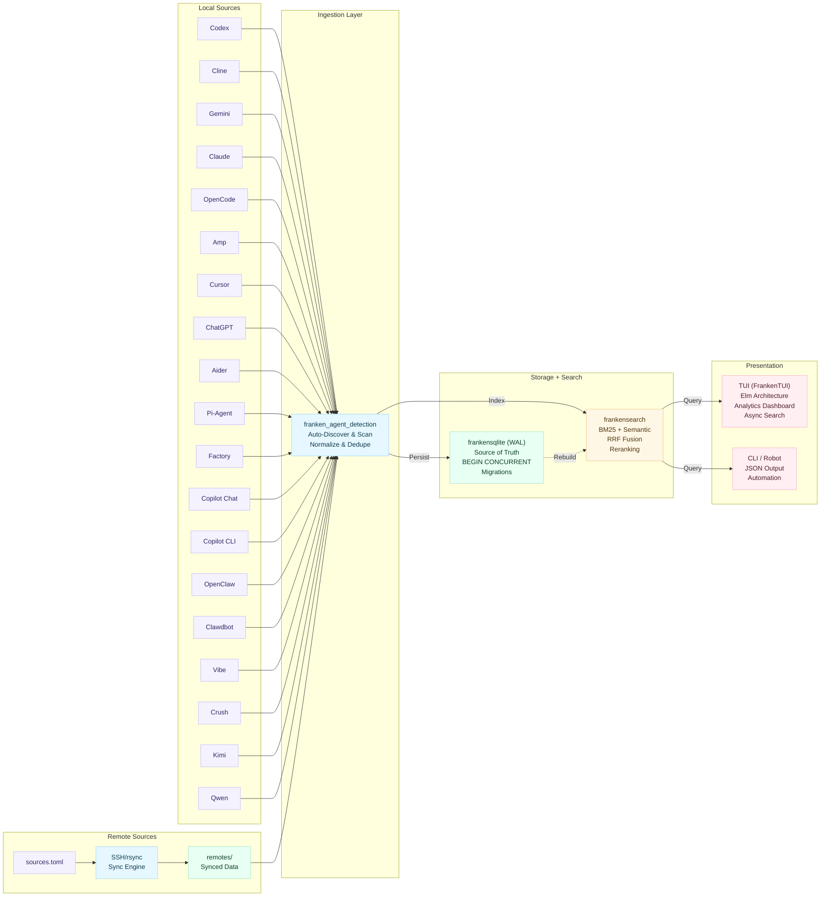
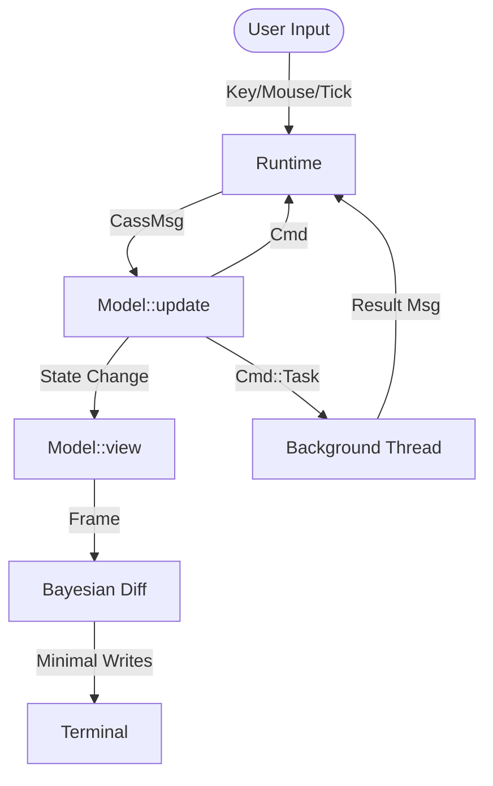

# 🔎 coding-agent-search (cass)

<div align="center">
  
</div>


[](https://codecov.io/gh/Dicklesworthstone/coding_agent_session_search)


**Unified, high-performance TUI to index and search your local coding agent history.**
Aggregates sessions from Codex, Claude Code, Gemini CLI, Cline, OpenCode, Amp, Cursor, ChatGPT, Aider, Pi-Agent, GitHub Copilot Chat, Copilot CLI, OpenClaw, Clawdbot, Vibe, Crush, Kimi Code, Qwen Code, and Factory (Droid) into a single, searchable timeline.

<div align="center">

```bash
curl -fsSL "https://raw.githubusercontent.com/Dicklesworthstone/coding_agent_session_search/main/install.sh?$(date +%s)" \
  | bash -s -- --easy-mode --verify
```

```powershell
# Windows (PowerShell)
irm https://raw.githubusercontent.com/Dicklesworthstone/coding_agent_session_search/main/install.ps1 | iex
install.ps1 -EasyMode -Verify
```

Installs the latest release by default. Pass `--version <tag>` / `-Version <tag>` to pin a specific version.

**Or via package managers:**

```bash
# Homebrew (Apple Silicon macOS + Linux)
brew install dicklesworthstone/tap/cass

# Windows (Scoop)
scoop bucket add dicklesworthstone https://github.com/Dicklesworthstone/scoop-bucket
scoop install dicklesworthstone/cass
```

Homebrew bottles are currently published for Linux and Apple Silicon macOS. On Intel macOS, use the install script with `--from-source`.

</div>

---

## 🤖 Agent Quickstart (Robot Mode)

⚠️ **Never run bare `cass` in an agent context** — it launches the interactive TUI. Always use `--robot` or `--json`.

```bash
# 1) One-shot agent triage. Follow next_command when present.
cass triage --json
#    From zero context, `cass --json` and `cass --robot` also resolve to triage.

# 2) Search across all agent history. Default search is hybrid-preferred:
#    lexical is the fast required path; semantic refinement joins when ready.
cass search "authentication error" --robot --limit 5 --fields minimal

# 3) Find the current or recent session for this workspace
cass sessions --current --json
cass sessions --workspace "$(pwd)" --json --limit 5

# 4) View + expand a hit (use source_path/line_number from search output)
cass view /path/to/session.jsonl -n 42 --json
cass expand /path/to/session.jsonl -n 42 -C 3 --json

# 5) Discover the full machine API
cass capabilities --json
cass robot-docs guide
cass robot-docs schemas

# 6) Exclude a noisy agent harness from future indexing
cass sources agents list --json
cass sources agents exclude openclaw
cass sources agents include openclaw
```

**Output conventions**
- stdout = data only
- stderr = diagnostics
- exit 0 = success

**Search asset contract**
- SQLite is the source of truth for indexed conversations and messages. All derived assets (lexical index, semantic vectors, analytics rollups, retention backups) can be rebuilt from SQLite; no derived asset is authoritative.
- Lexical search is the required fast path. Missing, stale, or incompatible lexical assets are treated as derived-state problems that cass should rebuild from SQLite instead of asking operators to perform routine manual repair.
- Hybrid is the default search intent. Robot metadata (`--robot --robot-meta`) reports the requested mode, realized mode, semantic refinement status, and any lexical fallback reason when semantic assets are not ready.
- Semantic assets are opportunistic background enrichment. Lexical-only results are expected during first indexing, semantic catch-up, disabled semantic policy, or unavailable local model/vector files.
- Semantic model acquisition is **opt-in**: `cass models install` downloads the requested embedder on explicit request; cass never auto-downloads. Three embedders are supported via `--model <name>`: `all-minilm-l6-v2` (alias `minilm`, ~90 MB; the default), `snowflake-arctic-s` (~120 MB), and `nomic-embed` (~270 MB). Air-gapped installs use `--from-file <dir>`. While the chosen model is absent, search silently uses lexical-only and reports `fallback_mode="lexical"` in health/status.
- `cass triage --json` is the safest first command for agents: it combines readiness, `next_command`, `recommended_commands[]`, docs/schema pointers, starter workflows, and accepted recoveries. `cass health --json` and `cass status --json` remain the narrower truth surfaces for readiness, active rebuilds, and recovery.

**Lexical publish durability (atomic-swap)**
- Every lexical publish is an atomic renameat2(RENAME_EXCHANGE) on Linux, or a parked-rename + restore-on-failure dance elsewhere. Readers never see a half-torn index — they see either the old or the new generation, never a mix. See `src/indexer/mod.rs::publish_staged_lexical_index`.
- The prior-live generation is retained under `<data_dir>/index/.lexical-publish-backups/<dated>/` for a bounded retention window. Default cap is `1` (keep just the most-recent prior generation for one-step rollback); override via the `CASS_LEXICAL_PUBLISH_BACKUP_RETENTION` env var (`0` disables retention entirely, higher N keeps deeper history). Pruning runs after every successful publish and emits structured `tracing::info!` events with `freed_bytes` + `retention_limit` for observability.
- Crash recovery is automatic: a crash between the atomic swap and the retain-rename is handled by `recover_or_finalize_interrupted_lexical_publish_backup` on the next startup, which moves any orphaned canonical sidecar (`.<name>.publish-in-progress.bak`) into `.lexical-publish-backups/` before the next publish lands.

**Quarantine, GC, and the doctor/diag surface**
- Corrupt or failed-validation assets are quarantined rather than auto-deleted. `cass diag --json --quarantine` enumerates every quarantined artifact (failed seed bundles, retained publish backups, quarantined lexical generations) with `size_bytes`, `age_seconds`, `safe_to_gc`, and a human-readable `gc_reason`. The `safe_to_gc` flag is **advisory** — it reflects retention policy + cleanup dry-run eligibility and is not wired to any automatic deletion path.
- `cass doctor --json` surfaces the same quarantine summary plus `checks[]` status for every diagnostic the tool runs. Without `--fix`, doctor is read-only (`auto_fix_applied=false`, `auto_fix_actions=[]`, `issues_fixed=0`); with `--fix` it applies only the repairs whose dry-run plans are proven safe (currently: Track A analytics rebuild, Track B rollup rebuild via `rebuild_token_daily_stats` when the `token_usage` ledger is intact).
- Lexical generation cleanup uses a dispositions + inspection-required-first policy. Operators running `cass doctor --fix` never have a generation reclaimed silently — every quarantine stays on disk until an explicit `cass models backfill` / `cass index --full --force-rebuild` replaces the source data.

**Schema stability guarantees**
- The JSON contract surfaces (`triage`, `capabilities`, `health`, `status`, `diag`, `models status`, `models verify`, `models check-update`, `introspect`, `doctor`, `api-version`, `stats`, `sessions`, `search`, `pack`) are pinned by golden-file regression tests under `tests/golden/robot/`. A change to any field name, type, or nullability fails the golden test suite and requires a deliberate regeneration pass (`UPDATE_GOLDENS=1 rch exec -- env CARGO_TARGET_DIR=/tmp/cass-golden-target cargo test --test golden_robot_json --test golden_robot_docs`).
- `cass introspect --json`'s `response_schemas` block enumerates every schema in a stable alphabetical order (`BTreeMap`-backed — see bead coding_agent_session_search-8sl73).
- Error envelopes (`{error: {code, kind, message, hint, retryable}}`) have a fixed shape. `kind` values are kebab-case; branch on `err.kind`, not on the numeric code, for codes ≥ 10 (see the Error Handling section below).

## 📬 Agent Mail Fallback (When MCP Tools Are Not Exposed)

If your runtime does not expose built-in `mcp-agent-mail` tools (for example, `list_mcp_resources` is empty), you can still coordinate via direct MCP HTTP calls.

### 1) Start the local Agent Mail server

```bash
~/.local/pipx/venvs/mcp-agent-mail/bin/python -m mcp_agent_mail.cli serve-http --host 127.0.0.1 --port 8765
```

### 2) Use the Streamable HTTP MCP endpoint (`/mcp`)

```bash
curl -sS -X POST http://127.0.0.1:8765/mcp \
  -H 'Content-Type: application/json' \
  -d '{"jsonrpc":"2.0","id":"health","method":"tools/call","params":{"name":"health_check","arguments":{}}}'
```

### 3) Minimal coordination flow (project -> agent -> message -> inbox -> ack)

```bash
# Ensure project
curl -sS -X POST http://127.0.0.1:8765/mcp -H 'Content-Type: application/json' -d \
'{"jsonrpc":"2.0","id":"ensure","method":"tools/call","params":{"name":"ensure_project","arguments":{"human_key":"/data/projects/coding_agent_session_search"}}}'

# Register agent
curl -sS -X POST http://127.0.0.1:8765/mcp -H 'Content-Type: application/json' -d \
'{"jsonrpc":"2.0","id":"register","method":"tools/call","params":{"name":"register_agent","arguments":{"project_key":"/data/projects/coding_agent_session_search","program":"codex","model":"gpt-5","name":"YourAgentName"}}}'

# Send message
curl -sS -X POST http://127.0.0.1:8765/mcp -H 'Content-Type: application/json' -d \
'{"jsonrpc":"2.0","id":"send","method":"tools/call","params":{"name":"send_message","arguments":{"project_key":"/data/projects/coding_agent_session_search","sender_name":"YourAgentName","to":["PeerAgent"],"subject":"[coord] hello","thread_id":"coord-2026-02-13","ack_required":true,"body_md":"Online and starting work."}}}'

# Fetch inbox
curl -sS -X POST http://127.0.0.1:8765/mcp -H 'Content-Type: application/json' -d \
'{"jsonrpc":"2.0","id":"inbox","method":"tools/call","params":{"name":"fetch_inbox","arguments":{"project_key":"/data/projects/coding_agent_session_search","agent_name":"YourAgentName","limit":50,"include_bodies":true}}}'

# Acknowledge message id 42
curl -sS -X POST http://127.0.0.1:8765/mcp -H 'Content-Type: application/json' -d \
'{"jsonrpc":"2.0","id":"ack","method":"tools/call","params":{"name":"call_extended_tool","arguments":{"tool_name":"acknowledge_message","arguments":{"project_key":"/data/projects/coding_agent_session_search","agent_name":"YourAgentName","message_id":42}}}}'
```

### Important caveat

`mcp_agent_mail` defaults to `sqlite+aiosqlite:///./storage.sqlite3`. That means the server working directory determines which mailbox database you are using. To avoid "project not found" confusion, start the server from the same directory your team expects for mailbox state.

## 📸 Screenshots

<div align="center">

### Search Results Across All Your Agents
*Three-pane layout with semantic styling: filter bar with pills, results list with color-coded agents and score tiers, and syntax-highlighted detail preview with tab navigation*


---

### Rich Conversation Detail View
*Full conversation rendering with markdown formatting, code blocks, headers, and structured content*


---

### Quick Start & Keyboard Reference
*Built-in help screen (press `F1` or `?`) with all shortcuts, filters, modes, and navigation tips*


</div>

---

## 💡 Why This Exists

### The Problem

AI coding agents are transforming how we write software. Claude Code, Codex, Cursor, Copilot, Aider, Pi-Agent; each creates a trail of conversations, debugging sessions, and problem-solving attempts. But this wealth of knowledge is **scattered and unsearchable**:

- **Fragmented storage**: Each agent stores data differently—JSONL files, SQLite databases, markdown logs, proprietary JSON formats
- **No cross-agent visibility**: Solutions discovered in Cursor are invisible when you're using Claude Code
- **Lost context**: That brilliant debugging session from two weeks ago? Good luck finding it by scrolling through files
- **No semantic search by default**: File-based grep doesn't understand natural language queries; cass can add optional local ML search when model files are installed

### The Solution

`cass` treats your coding agent history as a **unified knowledge base**. It:

1. **Normalizes** disparate formats into a common schema
2. **Indexes** everything with a purpose-built full-text search engine
3. **Surfaces** relevant past conversations in milliseconds
4. **Respects** your privacy—everything stays local, nothing phones home

### Who Benefits

- **Individual developers**: Find that solution you know you've seen before
- **Teams**: Share institutional knowledge across different tool preferences
- **AI agents themselves**: Let your current agent learn from all your past agents (via robot mode)
- **Power users**: Build workflows that leverage your complete coding history

---

## ✨ Key Features

### ⚡ Instant Search (Sub-60ms Latency)
- **"Search-as-you-type"**: Results update instantly with every keystroke.
- **Edge N-Gram Indexing**: We frontload the work by pre-computing prefix matches (e.g., "cal" -> "calculate") during indexing, trading disk space for O(1) lookup speed at query time.
- **Smart Tokenization**: Handles `snake_case` ("my_var" matches "my" and "var"), hyphenated terms, and code symbols (`c++`, `foo.bar`) correctly.
- **Zero-Stall Updates**: The background indexer commits changes atomically; `reader.reload()` ensures new messages appear in the search bar immediately without restarting.

### 🧠 Optional Semantic Search (Local Inference, No Network at Query Time)
- **Local inference**: Uses a FastEmbed embedder running ONNX on-device. Once the chosen model is installed, no network traffic is required to answer queries.
- **Opt-in acquisition**: `cass models install` downloads the requested embedder from Hugging Face on explicit request and verifies SHA256 checksums. Nothing is fetched until you run the install command. Three embedders are supported:
  - `all-minilm-l6-v2` — `cass models install --model all-minilm-l6-v2` (alias: `minilm`). 384-dim. ~90 MB. The default; fastest. Best for general English semantic similarity.
  - `snowflake-arctic-s` — `cass models install --model snowflake-arctic-s`. 384-dim. ~120 MB. Stronger MTEB scores than MiniLM at similar cost; good drop-in replacement for code-heavy corpora.
  - `nomic-embed` — `cass models install --model nomic-embed` (alias: `nomic-embed-text-v1.5`). 768-dim. ~270 MB. Highest recall on long-context queries; trade off larger index footprint.

  Removal mirrors install: `cass models remove --model <name>` accepts the same alias set. The same alias map is honored by the daemon embedding worker (see `src/daemon/worker.rs::resolve_embedder_kind`) so background indexing accepts whatever the operator installed.

- **Air-gapped install**: `cass models install --model <name> --from-file <dir>` accepts a pre-downloaded model directory so you can bring the assets in yourself.
- **Required files** (all must be present after install; `cass models verify` checks them):
  - `model.onnx`
  - `tokenizer.json`
  - `config.json`
  - `special_tokens_map.json`
  - `tokenizer_config.json`
- **Vector index**: Stored as `vector_index/index-<embedder>.fsvi` in the data directory.
- **Lexical fail-open**: While the model is absent, `cass` returns lexical-only results and reports `fallback_mode="lexical"` in health/status; search never blocks on semantic assets.

#### Hash Embedder Fallback

When ML model files are not installed, `cass` uses a deterministic hash-based embedder as a fallback. While not "truly" semantic (it captures lexical overlap rather than meaning), it provides useful functionality:

| Feature | ML Model (MiniLM) | Hash Embedder (FNV-1a) |
|---------|-------------------|------------------------|
| **Meaning Understanding** | ✅ "car" ≈ "automobile" | ❌ Exact tokens only |
| **Initialization Time** | ~500ms (model loading) | <1ms (instant) |
| **Network Dependency** | None (after install) | None |
| **Disk Footprint** | ~90MB model files | 0 bytes |
| **Deterministic** | ✅ Same input = same output | ✅ Same input = same output |

**Algorithm**:
1. **Tokenize**: Lowercase, split on non-alphanumeric, filter tokens <2 characters
2. **Hash**: Apply FNV-1a to each token
3. **Project**: Use hash to determine dimension index and sign (+1 or -1) in a 384-dimensional vector
4. **Normalize**: L2 normalize to unit length for cosine similarity

**When to Use**:
- Quick setup without downloading model files
- Environments where ML inference overhead is unwanted
- Fallback when ML model fails to load

**Override**: Set `CASS_SEMANTIC_EMBEDDER=hash` to force hash mode even when ML model is available.

#### FSVI Vector Index Format

`cass` uses the **frankensearch FSVI** vector index format (`.fsvi`) for storing semantic embeddings.

**Features**:
- **Memory-mappable**: large indexes open without copying into RAM
- **Quantization**: supports `f32` and `f16` storage for smaller on-disk size
- **Fast search**: brute-force vector search and optional HNSW approximate search

**Index Location**: `~/.local/share/coding-agent-search/vector_index/index-<embedder>.fsvi`

#### Search Modes

`cass` supports three search modes, selectable via `--mode` flag or `Alt+S` in the TUI:

| Mode | Algorithm | Best For |
|------|-----------|----------|
| **Lexical** | BM25 full-text | Exact term matching, code searches |
| **Semantic** | Vector similarity | Conceptual queries, "find similar" |
| **Hybrid** (default) | Reciprocal Rank Fusion with lexical fail-open | Balanced precision and recall |

**Lexical Search**: Uses Tantivy's BM25 implementation with edge n-grams for prefix matching. Best when you know the exact terms you're looking for. The lexical index is derived from SQLite; if it is missing, stale, or incompatible, cass reports the state and rebuilds through the normal indexing path from the canonical database.

**Semantic Search**: Computes vector similarity between query and indexed message embeddings. Finds conceptually related content even without exact term overlap. Requires either the ML model (MiniLM) or falls back to hash embedder.

**Hybrid Search**: The default. It combines lexical and semantic results using Reciprocal Rank Fusion (RRF) when semantic assets are ready, and it fails open to lexical when semantic enrichment is still catching up or disabled:
```
RRF_score = Σ 1 / (K + rank_i)
```
Where K=60 (tuning constant) and rank_i is the position in each result list. This balances the precision of lexical search with the recall of semantic search.

```bash
# CLI examples
cass search "authentication" --mode lexical --robot
cass search "how to handle user login" --mode semantic --robot
cass search "auth error handling" --mode hybrid --robot
```

### 🎯 Advanced Search Features
- **Wildcard Patterns**: Full glob-style pattern support:
  - `foo*` - Prefix match (finds "foobar", "foo123")
  - `*foo` - Suffix match (finds "barfoo", "configfoo")
  - `*foo*` - Substring match (finds "afoob", "configuration")
- **Auto-Fuzzy Fallback**: When exact searches return sparse results, automatically retries with `*term*` wildcards to broaden matches. Visual indicator shows when fallback is active.
- **Query History Deduplication**: Recent searches deduplicated to show unique queries; navigate with `Up`/`Down` arrows.
- **Match Quality Ranking**: New ranking mode (cycle with `F12`) that prioritizes exact matches over wildcard/fuzzy results.
- **Match Highlighting**: Use `--highlight` in robot mode to wrap matching terms with markers (`**bold**` for text, `<mark>` for HTML output).

### 🖥️ Rich Terminal UI (TUI)

Powered by [FrankenTUI (ftui)](https://github.com/Dicklesworthstone/frankentui) — a high-performance Elm-architecture TUI framework with adaptive frame budgets, Bayesian diff selection, and spring-based animations.

- **Three-Pane Layout**: Filter bar (top), scrollable results (left), and syntax-highlighted details (right).
- **Multi-Line Result Display**: Each result shows location and up to 3 lines of context; alternating stripes improve scanability.
- **Live Status**: Footer shows real-time indexing progress—agent discovery count during scanning, then item progress with sparkline visualization (e.g., `📦 Indexing 150/2000 (7%) ▁▂▄▆█`)—plus active filters.
- **Multi-Open Queue**: Queue multiple results with `Ctrl+Enter`, then open all in your editor with `Ctrl+O`. Confirmation prompt for large batches (≥12 items).
- **Find-in-Detail**: Press `/` to search within the detail pane; matches highlighted with `n`/`N` navigation.
- **Mouse Support**: Click to select results, scroll panes, or clear filters.
- **Theming**: Adaptive Dark/Light modes with role-colored messages (User/Assistant/System). Presets include dark, light, high-contrast, and accessible variants.
- **Ranking Modes**: Cycle through `recent`/`balanced`/`relevance`/`quality` with `F12`; quality mode penalizes fuzzy matches.
- **Analytics Dashboard**: 7 views (Dashboard, Explorer, Heatmap, Breakdowns, Tools, Plans, Coverage) with interactive charts, KPI tiles, and drill-down filtering. Toggle with `A`.
- **Inline Mode**: Run `cass tui --inline` to keep terminal scrollback intact. The UI anchors to a region of the terminal while logs scroll normally. Configure with `--ui-height <rows>` and `--anchor top|bottom`.
- **Macro Recording**: Capture input sessions with `cass tui --record-macro session.macro` for reproducible bug reports and workflow automation. Events are saved as human-readable JSONL with full timing data.
- **Asciicast Recording**: Capture reproducible TUI demos and bug repro artifacts with `cass tui --asciicast demo.cast`.
  - Security default: recording captures terminal output only (input keystrokes are not serialized by default).

### 📄 HTML Session Export

Export conversations as styled, portable HTML files with optional encryption:

- **Mostly Self-Contained**: Critical structural CSS and the export payload are inlined directly; the file opens without a local web server. Tailwind's utility CSS runtime (`@tailwindcss/browser`) and Prism.js syntax-highlighting assets are loaded from `cdn.jsdelivr.net` for full fidelity.
- **Progressive Enhancement / Graceful Degradation**: Prism.js resources fall back via `onerror="...no-prism"` — code blocks remain readable offline in plain monospace. Tailwind CDN does not currently have a built-in fallback: layout utilities require network on first open (the page is still legible but unstyled). Air-gapped archival users should note this limitation.
- **Password Protection**: AES-256-GCM encryption with PBKDF2 key derivation (600,000 iterations)—opens directly in any browser
- **Rich Styling**: Dark/light themes, syntax-highlighted code blocks, collapsible tool calls
- **Print-Friendly**: Optimized print styles with page breaks and footers
- **Searchable**: Built-in search functionality within the exported document

**TUI Usage**: Press `e` in the detail view to open the export modal, or `Ctrl+E` for quick export with defaults.

**CLI Usage**:
```bash
# Basic export
cass export-html /path/to/session.jsonl

# With encryption
printf '%s\n' "secret" | cass export-html /path/to/session.jsonl --encrypt --password-stdin

# Custom output location
cass export-html session.jsonl --output-dir ~/exports --filename "my-session"

# Open in browser after export
cass export-html session.jsonl --open

# Robot mode (JSON output)
cass export-html session.jsonl --json
```

### 🔗 Universal Connectors
Ingests history from 19 local agents, normalizing them into a unified `Conversation -> Message -> Snippet` model:
- **Codex**: `~/.codex/sessions` (Rollout JSONL)
- **Cline**: VS Code global storage (Task directories)
- **Gemini CLI**: `~/.gemini/tmp` (Chat JSON)
- **Claude Code**: `~/.claude/projects` (Session JSONL)
- **Clawdbot**: `~/.clawdbot/sessions` (Session JSONL)
- **Vibe (Mistral)**: `~/.vibe/logs/session/*/messages.jsonl` (Session JSONL)
- **OpenCode**: `.opencode` directories (SQLite)
- **Amp**: `~/.local/share/amp` & VS Code storage
- **Cursor**: `~/Library/Application Support/Cursor/User/` global + workspace storage (SQLite `state.vscdb`)
- **ChatGPT**: `~/Library/Application Support/com.openai.chat` (v1 unencrypted JSON; v2/v3 encrypted—see Environment)
- **Aider**: `~/.aider.chat.history.md` and per-project `.aider.chat.history.md` files (Markdown)
- **Pi-Agent**: `~/.pi/agent/sessions` (Session JSONL with thinking content)
- **GitHub Copilot Chat**: VS Code global storage under `github.copilot-chat` (JSON)
- **Copilot CLI**: `~/.copilot/session-state`, legacy `~/.copilot/history-session-state`, and `gh copilot` config paths (JSONL/JSON)
- **OpenClaw**: `~/.openclaw/agents/*/sessions` (Session JSONL)
- **Crush**: `~/.crush/crush.db` and per-project `.crush/crush.db` (SQLite)
- **Kimi Code**: `~/.kimi/sessions/*/*/wire.jsonl` (Session JSONL)
- **Qwen Code**: `~/.qwen/tmp/*/chats/session-*.json` (Chat JSON)
- **Factory (Droid)**: `~/.factory/sessions` (JSONL files organized by workspace slug)

#### Connector Details

**Pi-Agent** parses JSONL session files with rich event structure:
- **Location**: `~/.pi/agent/sessions/` (override with `PI_CODING_AGENT_DIR` env var)
- **Format**: Typed events—`session_start`, `message`, `model_change`, `thinking_level_change`
- **Features**: Extracts extended thinking content, flattens tool calls with arguments, tracks model changes
- **Detection**: Scans for `*_*.jsonl` pattern in sessions directory

**OpenCode** reads SQLite databases from workspace directories:
- **Location**: `.opencode/` directories (scans recursively from home)
- **Format**: SQLite database with sessions table
- **Detection**: Finds directories named `.opencode` containing database files

### 🌐 Remote Sources (Multi-Machine Search)

Search across agent sessions from multiple machines—your laptop, desktop, and remote servers—all from a single unified index. `cass` uses SSH/rsync to efficiently sync session data, tracking provenance so you know where each conversation originated.

#### Interactive Setup Wizard (Recommended)

The easiest way to configure multi-machine search is the interactive setup wizard:

```bash
cass sources setup
```

**What the wizard does:**

1. **Discovers** SSH hosts from your `~/.ssh/config`
2. **Probes** each host to check for:
   - Existing cass installation (and version)
   - Agent session data (Claude, Codex, Cursor, Gemini, etc.)
   - System resources (disk space, memory)
3. **Lets you select** which hosts to configure
4. **Installs cass** on remotes that don't have it (optional)
5. **Indexes** existing sessions on remotes (optional)
6. **Configures** `sources.toml` with correct paths and mappings
7. **Syncs** data to your local machine (optional)

**Wizard options:**

| Flag | Purpose |
|------|---------|
| `--hosts <names>` | Configure only specific hosts (comma-separated) |
| `--dry-run` | Preview changes without applying them |
| `--non-interactive` | Use auto-detected defaults for scripting |
| `--skip-install` | Don't install cass on remotes |
| `--skip-index` | Don't run indexing on remotes |
| `--skip-sync` | Don't sync data after setup |
| `--resume` | Resume an interrupted setup |
| `--json` | Output progress as JSON (for automation) |

**Examples:**

```bash
# Full interactive wizard
cass sources setup

# Configure specific hosts only
cass sources setup --hosts css,csd,yto

# Preview without making changes
cass sources setup --dry-run

# Resume interrupted setup
cass sources setup --resume

# Non-interactive for CI/CD
cass sources setup --non-interactive --hosts myserver --skip-install
```

**Resumable state:** If setup is interrupted (Ctrl+C, connection lost), state is saved to the cache directory (`~/.cache/cass/setup_state.json` on Linux). Resume with `--resume`.

#### Remote Installation Methods

When the wizard installs `cass` on remote machines, it uses an intelligent fallback chain:

| Priority | Method | Speed | Requirements |
|----------|--------|-------|--------------|
| 1 | **cargo-binstall** | ~30s | `cargo-binstall` pre-installed, compatible release binary |
| 2 | **Pre-built binary** | ~10s | curl/wget, GitHub access, compatible release binary |
| 3 | **cargo install** | ~5min | Rust toolchain, 1GB disk, 2GB RAM |
| 4 | **Full bootstrap** | ~10min | curl, 1GB disk, 2GB RAM (installs rustup) |

**Resource Requirements**:
- Minimum 1GB disk space for installation
- Recommended 2GB RAM for compilation
- Linux pre-built binaries require glibc 2.38+ on conventional FHS-style distributions; older glibc, musl-only, and NixOS hosts fall back to source installation when possible.
- SSH access with key-based authentication

**What Gets Installed**:
- The `cass` binary (location depends on method: `~/.cargo/bin/cass` for cargo-based, `~/.local/bin/cass` for pre-built binary)
- No daemon, no background services—just the binary

**Installation Progress**: The wizard shows real-time progress for each stage:
```
Installing cass on laptop...
  [1/4] Checking environment...     ✓
  [2/4] Downloading binary...       ████████░░ 80%
  [3/4] Verifying checksum...       ✓
  [4/4] Setting up PATH...          ✓
```

Use `--skip-install` if you prefer to install manually on remotes.

#### Host Discovery & Probing

The setup wizard automatically discovers SSH hosts from your configuration:

**Discovery Sources**:
- `~/.ssh/config` (parses Host entries)
- Hosts with wildcards (`*`, `?`) are automatically excluded

**Probe Results** (for each discovered host):
| Check | Purpose |
|-------|---------|
| **Connectivity** | Can we establish SSH connection? |
| **cass Version** | Is cass already installed? What version? |
| **Agent Data** | Which agents have session data? |
| **Session Count** | How many conversations exist? |
| **System Info** | OS, architecture, disk space, memory |

**Probe Caching**: Results are cached for 5 minutes to speed up repeated setup attempts. Cache clears automatically on expiry.

#### Manual Setup

For manual configuration without the wizard:

```bash
# Add a remote machine using platform presets
cass sources add user@laptop.local --preset macos-defaults

# Or specify paths explicitly
cass sources add dev@workstation --path ~/.claude/projects --path ~/.codex/sessions

# Sync sessions from all configured sources
cass sources sync

# Check source health and connectivity
cass sources doctor
```

#### Remote Archive Safety

Remote source diagnostics are intentionally local-only. `cass triage --json`,
`cass doctor --json`, `cass health --json`, and `cass status --json` report the
`remote_source_sync` summary from cass-owned evidence: `sources.toml`,
`sync_status.json`, the local `remotes/<source>/mirror/` copy, and archive DB
provenance rows. They do not open SSH sessions, mutate remote machines, or
rewrite provider session logs while classifying source gaps.

This matters because agent harnesses can prune their own logs. If a laptop is
retired, a remote path disappears, or a provider truncates older sessions, the
cass archive DB and cass-owned local mirror may be the only remaining evidence
for those conversations. Treat gap names such as `remote_source_unavailable`,
`remote_source_pruned`, `local_archive_ahead_of_remote`, and
`remote_copy_ahead_verified` as preservation signals first: keep the archive and
mirror intact, then run the recommended `cass sources sync --all --json` or
source-specific sync command after reviewing the reported evidence.

#### Configuration File

Sources are configured in the platform config directory (Linux: `~/.config/cass/sources.toml`, macOS: `~/Library/Application Support/cass/sources.toml`):

```toml
[[sources]]
name = "laptop"
type = "ssh"
host = "user@laptop.local"
paths = ["~/.claude/projects", "~/.codex/sessions"]
sync_schedule = "manual"

[[sources]]
name = "workstation"
type = "ssh"
host = "dev@work.example.com"
paths = ["~/.claude/projects"]
sync_schedule = "daily"

# Path mappings rewrite remote paths to local equivalents
[[sources.path_mappings]]
from = "/home/dev/projects"
to = "/Users/me/projects"

# Agent-specific mappings
[[sources.path_mappings]]
from = "/opt/work"
to = "/Volumes/Work"
agents = ["claude_code"]
```

**Configuration Fields:**
| Field | Description |
|-------|-------------|
| `name` | Friendly identifier (becomes `source_id`) |
| `type` | Connection type: `ssh` or `local` |
| `host` | SSH host (`user@hostname`) |
| `paths` | Paths to sync (supports `~` expansion) |
| `sync_schedule` | `manual`, `hourly`, or `daily` |
| `path_mappings` | Rewrite remote paths to local equivalents |

#### CLI Commands

```bash
# List configured sources
cass sources list [--verbose] [--json]

# Add a new source
cass sources add <user@host> [--name <name>] [--preset macos-defaults|linux-defaults] [--path <path>...] [--no-test]

# Remove a source
cass sources remove <name> [--purge] [-y]

# Check connectivity and config
cass sources doctor [--source <name>] [--json]

# Sync sessions
cass sources sync [--source <name>] [--no-index] [--verbose] [--dry-run] [--json]
```

#### Excluding Noisy Agent Harnesses

If one harness is generating mostly junk or looped output, you can disable it persistently even if its files remain on disk:

```bash
# Inspect current include/exclude state
cass sources agents list --json

# Stop indexing this harness in future runs
cass sources agents exclude openclaw

# Re-enable it later
cass sources agents include openclaw
```

`cass` stores this preference in `sources.toml` (`~/.config/cass/sources.toml` on Linux, `~/Library/Application Support/cass/sources.toml` on macOS), so future scans, syncs, and watch-mode updates remember it automatically.

By default, `cass sources agents exclude <agent>` also removes already archived local data for that agent and rebuilds the lexical index so the exclusion frees space instead of only blocking future imports.

If you want to block future indexing but keep the data already archived:

```bash
cass sources agents exclude openclaw --keep-indexed-data
```

#### Sync Engine Internals

The sync engine uses rsync over SSH for efficient delta transfers, with automatic SFTP fallback:

**Transfer Methods** (auto-detected):
| Method | When Used | Characteristics |
|--------|-----------|-----------------|
| **rsync** | rsync available on both ends | Delta transfers, compression, progress stats |
| **SFTP** | rsync unavailable | Full file transfers via SSH native protocol |

**Safety Guarantees**:
- **Additive-only syncs**: rsync runs WITHOUT `--delete` flag—remote deletions never propagate locally
- **No overwrite risk**: Existing local files are only updated if remote is newer
- **Atomic operations**: Failed transfers don't leave partial files

**Transfer Configuration**:
| Setting | Default | Purpose |
|---------|---------|---------|
| Connection timeout | 10s | Fail fast on unreachable hosts |
| Transfer timeout | 5 min | Allow large initial syncs |
| Compression | Enabled | Reduce bandwidth for text-heavy sessions |
| Partial transfers | Enabled | Resume interrupted syncs |

**rsync Flags Used**:
```
-avz --stats --partial --protect-args --timeout=300 \
  -e "ssh -o BatchMode=yes -o ConnectTimeout=10 -o StrictHostKeyChecking=accept-new"
```
Where `-avz` = archive mode + verbose + compression.

**Data Flow**:
```
Remote: ~/.claude/projects/
    ↓ (rsync over SSH)
Local: ~/.local/share/coding-agent-search/remotes/<source>/<path>/
    ↓ (connector scan)
Index: agent_search.db + tantivy_index/
```

Where `<path>` is a filesystem-safe version of the remote path (e.g., `.claude_projects`).

Sessions from remotes are indexed alongside local sessions, with provenance tracking to identify origin.

#### Path Mappings

When viewing sessions from remote machines, workspace paths may not exist locally. Path mappings rewrite these paths so file links work on your local machine:

```bash
# List current mappings
cass sources mappings list laptop

# Add a mapping
cass sources mappings add laptop --from /home/user/projects --to /Users/me/projects

# Test how a path would be rewritten
cass sources mappings test laptop /home/user/projects/myapp/src/main.rs
# Output: /Users/me/projects/myapp/src/main.rs

# Agent-specific mappings (only apply for certain agents)
cass sources mappings add laptop --from /opt/work --to /Volumes/Work --agents claude_code,codex

# Remove a mapping by index
cass sources mappings remove laptop 0
```

#### TUI Source Filtering

In the TUI, filter sessions by origin:
- **F11**: Cycle source filter (all → local → remote → all)
- **Shift+F11**: Open source filter menu to select specific sources

Remote sessions display with a source indicator (e.g., `[laptop]`) in the results list.

#### Provenance Tracking

Each conversation tracks its origin:
- `source_id`: Machine identifier (e.g., "laptop", "workstation")
- `source_kind`: `local` or `remote`
- `workspace_original`: Original path on the remote machine (before path mapping)

These fields appear in JSON/robot output and enable filtering:
```bash
cass search "auth error" --source laptop --json
cass timeline --days 7 --source remote
cass stats --by-source
```

## 🤖 AI / Automation Mode

`cass` is purpose-built for consumption by AI coding agents—not just as an afterthought, but as a first-class design goal. When you're an AI agent working on a codebase, your own session history and those of other agents become an invaluable knowledge base: solutions to similar problems, context about design decisions, debugging approaches that worked, and institutional memory that would otherwise be lost.

### Why Cross-Agent Search Matters

Imagine you're Claude Code working on a React authentication bug. With `cass`, you can instantly search across:
- Your own previous sessions where you solved similar auth issues
- Codex sessions where someone debugged OAuth flows
- Cursor conversations about token refresh patterns
- Aider chats about security best practices

This cross-pollination of knowledge across different AI agents is transformative. Each agent has different strengths, different context windows, and encounters different problems. `cass` unifies all this collective intelligence into a single, searchable index.

### Self-Documenting API

`cass` teaches agents how to use it—no external documentation required:

```bash
# First-stop capability contract for agents
cass triage --json
cass capabilities --json
# → {"version": "...", "workflows": [...], "mistake_recoveries": [...], "commands": [...], "exit_codes": [...], "env_vars": [...]}

# Full API schema with argument types, defaults, and response shapes
cass introspect --json

# Topic-based help optimized for LLM consumption
cass robot-docs commands # All commands and flags
cass robot-docs schemas # Response JSON schemas
cass robot-docs examples # Copy-paste invocations
cass robot-docs exit-codes # Error handling guide
cass robot-docs guide # Quick-start walkthrough
```

### Forgiving Syntax (Agent-Friendly Parsing)

AI agents sometimes make syntax mistakes. `cass` aggressively normalizes input to maximize acceptance when intent is clear:

| What you type | What `cass` understands | Correction note |
|---------------|------------------------|-----------------|
| `cass -robot --limit=5` | `cass --robot --limit=5` | Single-dash long flags normalized |
| `cass --Robot --LIMIT 5` | `cass --robot --limit 5` | Case normalized |
| `cass find "auth"` | `cass search "auth"` | `find`/`query`/`q` → `search` via alias table |
| `cass --robot-docs` | `cass robot-docs` | Flag-as-subcommand detected |
| `cass ready --json` | `cass triage --json` | One-shot triage alias |
| `cass preflight --json` | `cass triage --json` | One-shot triage alias |
| `cass --json` | `cass triage --json` | Top-level robot request defaults to safe preflight |
| `cass --robot` | `cass triage --json` | Top-level robot request defaults to safe preflight |
| `cass --json search "auth"` | `cass search "auth" --json` | Leading structured flag moved to the robot-capable subcommand |
| `cass --robot status` | `cass status --json` | Leading robot flag canonicalized to JSON output |
| `cass search --query "auth" --json` | `cass search "auth" --json` | Named query option converted to required positional query |
| `cass search auth error --json` | `cass search "auth error" --json` | Adjacent unquoted query words folded into one search |
| `cass auth error --json` | `cass search "auth error" --json` | Unquoted robot-mode query words folded into search |
| `cass view --path session.jsonl --line 42 --json` | `cass view session.jsonl --line 42 --json` | Named path option converted to required positional path |
| `cass search "auth" --format json` | `cass search "auth" --robot-format json` | Familiar format spelling converted to robot format |
| `cass --format json status` | `cass status --robot-format json` | Leading format request moved to the target subcommand |
| `cass search "auth" --max-results 5` | `cass search "auth" --limit 5` | Result-count alias converted to canonical limit |
| `cass search "auth" -n 5` | `cass search "auth" --limit 5` | Familiar short count flag converted to canonical limit |
| `cass search "auth" --last 7 --before now` | `cass search "auth" --since -7d --until now` | Familiar time-window aliases converted to canonical filters |
| `cass search "auth" last=7d before=now` | `cass search "auth" --since -7d --until now` | Bare time-window assignments converted to canonical filters |
| `cass search "auth" --provider codex` | `cass search "auth" --agent codex` | Provider/tool/connector aliases converted to canonical agent filter |
| `cass search "auth" provider=codex` | `cass search "auth" --agent codex` | Bare provider assignment converted to canonical agent filter |
| `cass search auth provider codex limit 5` | `cass search auth --agent codex --limit 5` | Bare filter key/value pairs after a query converted to canonical flags |
| `cass search --limt 5` | `cass search --limit 5` | Flag typos within Levenshtein distance ≤2 corrected |

The CLI applies multiple normalization layers:
1. **Flag typo correction**: Long flag names within Levenshtein distance 2 are auto-corrected (e.g. `--limt` → `--limit`). *Subcommand typos are NOT fuzzy-corrected* — use one of the documented aliases instead (see layer 4 below). A typo that isn't a known alias will produce a clap usage error with the canonical form in the hint.
2. **Case normalization**: `--Robot`, `--LIMIT` → `--robot`, `--limit`
3. **Single-dash recovery**: `-robot` → `--robot` (common LLM mistake)
4. **Subcommand aliases**: `ready`/`preflight` → `triage`; `find`/`query`/`q`/`grep`/`lookup` → `search`; `ls`/`list`/`info`/`summary` → `stats`; `st`/`state` → `status`; `reindex`/`idx`/`rebuild` → `index`; `show`/`get`/`read` → `view`; `docs`/`help-robot`/`robotdocs` → `robot-docs`
5. **Root robot default**: `cass --json`, `cass --robot`, or `cass --robot-format json` with no subcommand runs read-only `triage`
6. **Leading structured flag recovery**: `--json`/`--robot` before a robot-capable subcommand is moved onto that subcommand
7. **Named positional recovery**: `--query` for search/pack and `--path`/`--source-path`/`--file`/`--session` for drill-down/export commands become the required positional argument
8. **Multi-word query recovery**: adjacent unquoted query words after `search`/`pack` become one query positional
9. **Structured format recovery**: `--format json|jsonl|compact|sessions|toon` is accepted as `--robot-format ...` on robot-capable commands; `export --format ...` keeps its export-format meaning
10. **Result-count aliases**: `--max-results`, `--num-results`, `--results`, `--count`, `--top-k`, and `-n` become `--limit` on commands with result limits
11. **Time-window aliases**: `--last 7`, `--before now`, `last=7d`, and `before=now` become canonical `--since`/`--until` filters
12. **Provider aliases**: `--provider`, `--tool`, `--connector`, and matching assignments become canonical `--agent` filters on search-like commands
13. **Bare option pairs**: after at least one search/pack query word, `provider codex`, `limit 5`, and `last 7d` become canonical filter flags before the remaining words are folded into the query
14. **Implicit robot search**: unquoted top-level words with an explicit robot/JSON output request become a `search` query unless they look like a subcommand typo
15. **Global flag hoisting**: Position-independent flag handling

When corrections are applied, `cass` emits a teaching note to stderr so agents learn the canonical syntax.

### Structured Output Formats

Every command supports machine-readable output:

```bash
# Pretty-printed JSON (default robot mode)
cass search "error" --robot

# Streaming JSONL: one hit per line. Add --robot-meta to prepend a
# _meta header line (elapsed_ms, next_cursor, state, index_freshness).
cass search "error" --robot-format jsonl               # hits only
cass search "error" --robot-format jsonl --robot-meta  # 1 _meta header + hits

# Compact single-line JSON (minimal bytes)
cass search "error" --robot-format compact

# Include performance metadata
cass search "error" --robot --robot-meta
# → { "hits": [...], "_meta": { "elapsed_ms": 12, "cache_hit": true, "wildcard_fallback": false, ... } }

# Deterministic answer pack for handoff prompts
cass pack "why did checkout fail" --robot --max-tokens 12000 --limit 40

# Freshness-sensitive pack: fail if selected evidence is outside the window
cass pack "checkout timeout after redirect" --robot \
  --freshness-policy strict --freshness-window-seconds 604800 \
  --max-tokens 12000 --require-evidence

# Token-budgeted pack for pasting into another agent
cass pack "checkout timeout after redirect" --robot \
  --max-tokens 4000 --max-evidence 8 --max-sessions 3 --max-excerpt-chars 600

# Pipeline from broad search to a bounded cited handoff
cass search "checkout timeout" --robot-format sessions \
  | cass pack "checkout timeout root cause" --robot --sessions-from -
```

**Design principle**: stdout contains only parseable JSON data; all diagnostics, warnings, and progress go to stderr.

Use `search` when you are still exploring candidate sessions. Use `pack` when
you need a compact, cited, extractive artifact to hand to another agent or a
human operator. Use `status`/`health` before trusting freshness-sensitive output,
and use `doctor` only for diagnostics or safe repair workflows. Use
`export-html` when you need a full browsable session archive; packs are
token-budgeted evidence bundles, not full exports and not external
summarization.

Pack robot output includes `health`, `freshness`, `privacy`, and `warnings`.
Warnings such as `privacy_redactions_applied`, `semantic_fallback_lexical`,
or `no_evidence_found` are data, not prose; branch on the JSON fields before
copying the pack into another tool. Stale selected evidence is structural:
inspect `freshness.stale_evidence_count`.

### Token Budget Management

LLMs have context limits. `cass` provides multiple levers to control output size:

| Flag | Effect |
|------|--------|
| `--fields minimal` | Only `source_path`, `line_number`, `agent` |
| `--fields summary` | Adds `title`, `score` |
| `--fields score,title,snippet` | Custom field selection |
| `--max-content-length 500` | Truncate long fields (UTF-8 safe, adds "...") |
| `--max-tokens 2000` | Soft budget (~4 chars/token); adjusts truncation dynamically |
| `--limit 5` | Cap number of results |
| `cass pack "query" --robot` | Build a cited handoff pack from selected search evidence |
| `pack --max-tokens N` | Set the pack planner's soft budget |
| `pack --max-evidence N` | Cap evidence items selected into the pack |
| `pack --max-sessions N` | Limit how many sessions can contribute evidence |
| `pack --max-excerpt-chars N` | Shorten each cited excerpt before token estimation |
| `pack --fields summary` | Return top-level summary fields for a smaller JSON envelope |
| `pack --freshness-policy strict --freshness-window-seconds N` | Reject stale evidence instead of silently mixing it into a pack |
| `pack --sessions-from FILE` | Restrict pack evidence to newline-delimited session paths; use `-` for stdin |

Truncated fields include a `*_truncated: true` indicator so agents know when they're seeing partial content.

Contributor verification for docs or contract changes should use `rch`, for example:

```bash
rch exec -- env CARGO_TARGET_DIR=${TMPDIR:-/tmp}/rch_target_cass_answer_pack_docs \
  cargo test --test golden_robot_docs
```

### Error Handling for Agents

Errors are structured, actionable, and include recovery hints. A real sample from `cass search foo --robot` against a fresh data dir:

```json
{
  "error": {
    "code": 3,
    "kind": "missing-index",
    "message": "cass has not been initialized in <data_dir> yet, so search cannot run until the first index completes.",
    "hint": "Run 'cass index --full' once to discover local sessions and build the initial archive.",
    "retryable": true
  }
}
```

**Kind names** are kebab-case (e.g. `missing-index`, `missing-db`, `semantic-unavailable`, `embedder-unavailable`, `ambiguous-source`, `timeout`, `config`, `lock-busy`, `network`). Agents that branch on `err.kind` should treat them as stable identifiers. The full set (~50 kinds as of 0.3.x) is defined in `src/lib.rs`; the canonical way to discover a kind programmatically is to trigger the condition and inspect `err.kind` from the JSON envelope.

**Exit codes** follow a semantic convention:
| Code | Meaning | Typical action |
|------|---------|----------------|
| 0 | Success | Parse stdout |
| 1 | Health check failed | Run `cass index --full` |
| 2 | Usage error | Fix syntax (hint provided) |
| 3 | Index/DB missing | Run `cass index --full` (retryable: true) |
| 4 | Network error | Check connectivity |
| 5 | Data corruption | Run `cass index --full --force-rebuild` |
| 6 | Incompatible version | Update cass |
| 7 | Lock/busy | Retry later |
| 8 | Partial result | Increase `--timeout` or reduce scope |
| 9 | Unknown error | Check `retryable` flag |
| 10 | Config / timeout | Depends on `err.kind` |
| 11 | Config validation | Fix config |
| 12 | Source / SSH | Check remote host |
| 13 | Mapping / not-found | Depends on `err.kind` |
| 14 | I/O / mapping | Retry or inspect path |
| 15 | Semantic / embedder unavailable | Install model or `--mode lexical` |
| 20-21 | Model acquisition | Check `err.kind`, `err.hint` |
| 22 | I/O during model handling | Retry |
| 23 | Model download | Retry or use `--from-file` |
| 24 | I/O during model verify/install | Retry |

**Codes ≥ 10 are domain-specific** and the numeric value alone is ambiguous (e.g. code 10 maps to either `config` or `timeout` kinds depending on context). Agents should branch on `err.kind` from the JSON error envelope — not on the numeric code — when handling codes ≥ 10. See the Error Handling section above for the canonical `kind` list.

The `retryable` field tells agents whether a retry might succeed (e.g., transient I/O) vs. guaranteed failure (e.g., invalid path).

### Session Analysis Commands

Beyond search, `cass` provides commands for deep-diving into specific sessions:

```bash
# Discover the current session for this workspace
cass sessions --current --json

# List recent sessions for a specific project
cass sessions --workspace /path/to/project --json --limit 5

# Export full conversation to shareable format
cass export /path/to/session.jsonl --format markdown -o conversation.md
cass export /path/to/session.jsonl --format json --include-tools

# Export as self-contained HTML with encryption (recommended for sharing)
cass export-html /path/to/session.jsonl                     # To Downloads folder
printf '%s\n' "pwd" | cass export-html session.jsonl --encrypt --password-stdin
cass export-html session.jsonl --open --json                # Open in browser, JSON output

# Common agent flow: find current session, then export it
cass export-html "$(cass sessions --current --json | jq -r '.sessions[0].path')" --json

# Expand context around a specific line (from search result)
cass expand /path/to/session.jsonl -n 42 -C 5 --json
# → Shows 5 messages before and after line 42

# Activity timeline: when were agents active?
cass timeline --today --json --group-by hour
cass timeline --since 7d --agent claude --json
# → Grouped activity counts, useful for understanding work patterns
```

### Aggregation & Analytics

Aggregate search results server-side to get counts and distributions without transferring full result data:

```bash
# Count results by agent
cass search "error" --robot --aggregate agent
# → { "aggregations": { "agent": { "buckets": [{"key": "claude_code", "count": 45}, ...] } } }

# Multi-field aggregation
cass search "bug" --robot --aggregate agent,workspace,date

# Combine with filters
cass search "TODO" --agent claude --robot --aggregate workspace
```

**Aggregation Fields**:
| Field | Description |
|-------|-------------|
| `agent` | Group by agent type (claude_code, codex, cursor, etc.) |
| `workspace` | Group by workspace/project path |
| `date` | Group by date (YYYY-MM-DD) |
| `match_type` | Group by match quality (exact, prefix, fuzzy) |

**Response Format**:
```json
{
  "aggregations": {
    "agent": {
      "buckets": [
        {"key": "claude_code", "count": 120},
        {"key": "codex", "count": 85}
      ],
      "other_count": 15
    }
  }
}
```

Top 10 buckets are returned per field, with `other_count` for remaining items.

### Chained Search (Pipeline Mode)

Chain multiple searches together by piping session paths from one search to another:

```bash
# Find sessions mentioning "auth", then search within those for "token"
cass search "authentication" --robot-format sessions | \
  cass search "refresh token" --sessions-from - --robot

# Build a filtered corpus from today's work
cass search --today --robot-format sessions > today_sessions.txt
cass search "bug fix" --sessions-from today_sessions.txt --robot
```

**How It Works**:
1. First search with `--robot-format sessions` outputs one session path per line
2. Second search with `--sessions-from <file>` restricts search to those sessions
3. Use `-` to read from stdin for true piping

**Use Cases**:
- **Drill-down**: Broad search → narrow within results
- **Cross-reference**: Find sessions with term A, then find term B within them
- **Corpus building**: Save session lists for repeated searches

### Match Highlighting

The `--highlight` flag wraps matching terms for visual/programmatic identification:

```bash
cass search "authentication error" --robot --highlight
# In text output: **authentication** and **error** are bold-wrapped
# In HTML export: <mark>authentication</mark> and <mark>error</mark>
```

Highlighting is query-aware: quoted phrases like `"auth error"` highlight as a unit; individual terms highlight separately.

### Pagination & Cursors

For large result sets, use cursor-based pagination:

```bash
# First page
cass search "TODO" --robot --robot-meta --limit 20
# → { "hits": [...], "_meta": { "next_cursor": "eyJ..." } }

# Next page
cass search "TODO" --robot --robot-meta --limit 20 --cursor "eyJ..."
```

Cursors are opaque tokens encoding the pagination state. They remain valid as long as the index isn't rebuilt.

### Request Correlation

For debugging and logging, attach a request ID:

```bash
cass search "bug" --robot --request-id "req-12345"
# → { "hits": [...], "_meta": { "request_id": "req-12345" } }
```

### Idempotent Operations

For safe retries (e.g., in CI pipelines or flaky networks):

```bash
cass index --full --idempotency-key "build-$(date +%Y%m%d)"
# If same key + params were used in last 24h, returns cached result
```

### Query Analysis

Debug why a search returned unexpected results:

```bash
cass search "auth*" --robot --explain
# → Includes parsed query AST, term expansion, cost estimates

cass search "auth error" --robot --dry-run
# → Validates query syntax without executing
```

### Traceability

For debugging agent pipelines:

```bash
cass search "error" --robot --trace-file /tmp/cass-trace.json
# Appends execution span with timing, exit code, and command details
```

### Search Flags Reference

| Flag | Purpose |
|------|---------|
| `--robot` / `--json` | JSON output (pretty-printed) |
| `--robot-format jsonl\|compact` | Streaming or single-line JSON |
| `--robot-meta` | Include `_meta` block (elapsed_ms, cache stats, index freshness) |
| `--fields minimal\|summary\|<list>` | Reduce payload size |
| `--max-content-length N` | Truncate content fields to N chars |
| `--max-tokens N` | Truncate content fields to N chars |
| `--timeout N` | Timeout in milliseconds; returns partial results on expiry |
| `--cursor <token>` | Cursor-based pagination (from `_meta.next_cursor`) |
| `--request-id ID` | Echoed in response for correlation |
| `--aggregate agent,workspace,date` | Server-side aggregations |
| `--explain` | Include query analysis (parsed query, cost estimate) |
| `--dry-run` | Validate query without executing |
| `--source <source>` | Filter by source: `local`, `remote`, `all`, or specific source ID |
| `--highlight` | Highlight matching terms in output |

### Index Flags Reference

| Flag | Purpose |
|------|---------|
| `--idempotency-key KEY` | Safe retries: same key + params returns cached result (24h TTL) |
| `--json` | JSON output with stats |

### Robot Documentation System

For machine-readable documentation, use `cass robot-docs <topic>`:

| Topic | Content |
|-------|---------|
| `commands` | Full command reference with all flags |
| `env` | Environment variables and defaults |
| `paths` | Data directory locations per platform |
| `guide` | Quick start guide for automation |
| `schemas` | JSON response schemas |
| `exit-codes` | Exit code meanings and retry guidance |
| `examples` | Copy-paste usage examples |
| `contracts` | API contract version and stability |
| `sources` | Remote sources configuration guide |

```bash
# Get documentation programmatically
cass robot-docs guide
cass robot-docs schemas
cass robot-docs exit-codes

# Machine-first help (wide output, no TUI assumptions)
cass --robot-help
```

### API Contract & Versioning

`cass` maintains a stable API contract for automation:

```bash
cass api-version --json
# → { "version": "0.4.0", "contract_version": "1", "breaking_changes": [] }

cass introspect --json
# → Full schema: all commands, arguments, response types
```

**Contract Version**: Currently `1`. Increments only on breaking changes.

**Guaranteed Stable**:
- Exit codes and their meanings
- JSON response structure for `--robot` output
- Flag names and behaviors
- `_meta` block format

### Ready-to-paste blurb for AGENTS.md / CLAUDE.md

```
🔎 cass — Search All Your Agent History

 What: cass indexes conversations from Claude Code, Codex, Cursor, Gemini, Aider, ChatGPT, and more into a unified, searchable index. Before solving a problem from scratch, check if any agent already solved something similar.

 ⚠️ NEVER run bare cass — it launches an interactive TUI. Always use --robot or --json.

 Quick Start

 # One-shot agent triage (read next_command when present)
 cass triage --json

 # Search across all agent histories
 cass search "authentication error" --robot --limit 5

 # Build a cited handoff pack from search evidence
 cass pack "authentication error root cause" --robot --max-tokens 12000 --limit 40

 # Tight handoff budget with freshness and privacy metadata
 cass pack "authentication error root cause" --robot --max-tokens 4000 --max-evidence 8 --fields summary

 # View a specific result (from search output)
 cass view /path/to/session.jsonl -n 42 --json

 # Expand context around a line
 cass expand /path/to/session.jsonl -n 42 -C 3 --json

 # Learn the full API
 cass capabilities --json # Static agent self-description
 cass robot-docs guide # LLM-optimized docs

 Why Use It

 - Cross-agent knowledge: Find solutions from Codex when using Claude, or vice versa
 - Forgiving syntax: Typos and wrong flags are auto-corrected with teaching notes
 - Token-efficient: --fields minimal returns only essential data; pack budgets cite only selected evidence
 - Copy-safe handoffs: pack warnings include freshness and privacy/redaction status

 Key Flags

 | Flag | Purpose |
 |------------------|--------------------------------------------------------|
 | --robot / --json | Machine-readable JSON output (required!) |
 | --fields minimal | Reduce payload: source_path, line_number, agent only |
 | pack --max-tokens N | Budget a cited handoff pack |
 | --limit N | Cap result count |
 | --agent NAME | Filter to specific agent (claude, codex, cursor, etc.) |
 | --days N | Limit to recent N days |

 stdout = data only, stderr = diagnostics. Exit 0 = success.
```

---

## 🔤 Query Language Reference

`cass` supports a rich query syntax designed for both humans and machines.

### Basic Queries

| Query | Matches |
|-------|---------|
| `error` | Messages containing "error" (case-insensitive) |
| `python error` | Messages containing both "python" AND "error" |
| `"authentication failed"` | Exact phrase match |
| `auth fail` | Both terms, in any order |

### Boolean Operators

Combine terms with explicit operators for complex queries:

| Operator | Example | Meaning |
|----------|---------|---------|
| `AND` | `python AND error` | Both terms required (default) |
| `OR` | `error OR warning` | Either term matches |
| `NOT` | `error NOT test` | First term, excluding second |
| `-` | `error -test` | Shorthand for NOT |

**Operator Precedence**: NOT binds tightest, then AND, then OR. Use parentheses (in robot mode) for explicit grouping.

```bash
# Complex boolean query
cass search "authentication AND (error OR failure) NOT test" --robot

# Exclude test files
cass search "bug fix -test -spec" --robot

# Either error type
cass search "TypeError OR ValueError" --robot
```

### Phrase Queries

Wrap terms in double quotes for exact phrase matching:

| Query | Matches |
|-------|---------|
| `"file not found"` | Exact sequence "file not found" |
| `"cannot read property"` | Exact JavaScript error message |
| `"def test_"` | Function definitions starting with test_ |

Phrases respect word order and proximity. Useful for error messages, code patterns, and specific terminology.

### Wildcard Patterns

| Pattern | Type | Matches | Performance |
|---------|------|---------|-------------|
| `auth*` | Prefix | "auth", "authentication", "authorize" | Fast (uses edge n-grams) |
| `*tion` | Suffix | "authentication", "function", "exception" | Slower (regex scan) |
| `*config*` | Substring | "reconfigure", "config.json", "misconfigured" | Slowest (full regex) |
| `test_*` | Prefix | "test_user", "test_auth", "test_helpers" | Fast |

**Tip**: Prefix wildcards (`foo*`) are optimized via pre-computed edge n-grams. Suffix and substring wildcards fall back to regex and are slower on large indexes.

### Query Modifiers

```bash
# Field-specific search (in robot mode)
cass search "error" --agent claude --workspace /path/to/project

# Time-bounded search
cass search "bug" --since 2024-01-01 --until 2024-01-31
cass search "bug" --today
cass search "bug" --days 7

# Combined filters
cass search "authentication" --agent codex --workspace myproject --week
```

### Flexible Time Input

`cass` accepts a wide variety of time/date formats for filtering:

| Format | Examples | Description |
|--------|----------|-------------|
| **Relative** | `-7d`, `-24h`, `-30m`, `-1w` | Days, hours, minutes, weeks ago |
| **Keywords** | `now`, `today`, `yesterday` | Named reference points |
| **ISO 8601** | `2024-11-25`, `2024-11-25T14:30:00Z` | Standard datetime |
| **US Dates** | `11/25/2024`, `11-25-2024` | Month/Day/Year |
| **Unix Timestamp** | `1732579200` | Seconds since epoch |
| **Unix Millis** | `1732579200000` | Milliseconds (auto-detected) |

**Intelligent Heuristics**:
- Numbers >10 digits are treated as milliseconds, otherwise seconds
- Two-digit years are expanded (24 → 2024)
- Date-only inputs default to midnight start or 23:59:59 end

```bash
# All equivalent for "last week"
cass search "bug" --since -7d
cass search "bug" --since "-1w"
cass search "bug" --days 7

# Date range
cass search "feature" --since 2024-01-01 --until 2024-01-31

# Mix formats
cass search "error" --since yesterday --until now
```

### Match Types

Search results include a `match_type` indicator:

| Type | Meaning | Score Boost |
|------|---------|-------------|
| `exact` | Query terms found verbatim | Highest |
| `prefix` | Matched via prefix expansion (e.g., `auth*`) | High |
| `suffix` | Matched via suffix pattern | Medium |
| `substring` | Matched via substring pattern | Lower |
| `fuzzy` | Auto-fallback match when exact results sparse | Lowest |

### Auto-Fuzzy Fallback

When an exact query returns fewer than 3 results, `cass` automatically retries with wildcard expansion:
- `auth` → `*auth*`
- Results are flagged with `wildcard_fallback: true` in robot mode
- TUI shows a "fuzzy" indicator in the status bar

---

## ⌨️ Complete Keyboard Reference

### Global Keys

| Key | Action |
|-----|--------|
| `Ctrl+C` | Quit |
| `F1` or `?` | Toggle help screen |
| `F2` | Toggle dark/light theme |
| `Ctrl+B` | Toggle border style (rounded/plain) |
| `Ctrl+Shift+R` | Force re-index |
| `Ctrl+Shift+Del` | Reset all TUI state |

### Search Bar (Query Input)

| Key | Action |
|-----|--------|
| Type | Live search as you type |
| `Enter` | Submit query immediately (if query is empty, edits last filter chip) |
| `Esc` | Clear query / exit search |
| `Up`/`Down` | Navigate query history |
| `Ctrl+R` | Cycle through query history |
| `Backspace` | Delete character; if empty, remove last filter chip |

### Navigation

| Key | Action |
|-----|--------|
| `Up`/`Down` | Move selection in results list |
| `Enter` | Open selected result in detail modal (Messages tab by default) |
| `Left`/`Right` | Switch focus between results and detail pane |
| `Tab`/`Shift+Tab` | Cycle focus: search → results → detail |
| `PageUp`/`PageDown` | Scroll by page |
| `Home`/`End` | Jump to first/last result |
| `Alt+h/j/k/l` | Vim-style navigation (left/down/up/right) |

### Filtering

| Key | Action |
|-----|--------|
| `F3` | Open agent filter palette |
| `F4` | Open workspace filter palette |
| `F5` | Set "from" time filter |
| `F6` | Set "to" time filter |
| `Shift+F3` | Scope to currently selected result's agent |
| `Shift+F4` | Clear workspace filter |
| `Shift+F5` | Cycle time presets: 24h → 7d → 30d → all |
| `Ctrl+Del` | Clear all active filters |

### Modes & Display

| Key | Action |
|-----|--------|
| `F7` | Cycle context window size: S → M → L → XL |
| `F9` | Toggle match mode: prefix (default) ↔ standard |
| `F12` | Cycle ranking: recent → balanced → relevance → quality → newest → oldest |
| `Shift+`/`=` | Increase items per pane (density) |
| `-` | Decrease items per pane |

### Selection & Actions

| Key | Action |
|-----|--------|
| `Ctrl+M` / `Ctrl+X` | Toggle selection on current result |
| `Ctrl+A` | Select/deselect all visible results |
| `A` | Open bulk actions menu (when items selected) |
| `Ctrl+Enter` | Add to multi-open queue |
| `Ctrl+O` | Open all queued items in editor |
| `y` | Copy current item (path or content to clipboard) |
| `Ctrl+Y` | Copy all selected items |

### Detail Pane

| Key | Action |
|-----|--------|
| `Space` | Toggle full-screen detail view |
| `/` | Start find-in-detail search |
| `n` | Jump to next match (in find mode) |
| `N` | Jump to previous match |
| `g` | Scroll to top (in full-screen) |
| `G` | Scroll to bottom (in full-screen) |
| `c` | Copy visible content |
| `o` | Open in external viewer |
| `[` / `]` | Switch detail tabs (Messages/Snippets/Raw) |
| `F7` | Cycle context window size |
| `Ctrl+Space` | Momentary "peek" to XL context |

### Detail Tabs

The detail pane has three tabs, switchable with `[` and `]`:

| Tab | Content | Best For |
|-----|---------|----------|
| **Messages** | Full conversation with markdown rendering | Reading full context |
| **Snippets** | Keyword-extracted summaries | Quick scanning |
| **Raw** | Unformatted JSON/text | Debugging, copying exact content |

### Context Window Sizing

Control how much content shows in the detail preview. Cycle with `F7`:

| Size | Characters | Use Case |
|------|------------|----------|
| **Small** | ~200 | Quick scanning, narrow terminals |
| **Medium** | ~400 | Default balanced view |
| **Large** | ~800 | Reading longer passages |
| **XLarge** | ~1600 | Full context, code review |

**Peek Mode** (`Ctrl+Space`): Temporarily expand to XL context. Press again to restore previous size. Useful for quick deep-dives without changing your preferred default.

### Mouse Support

- **Click** on result to select
- **Click** on filter chip to edit/remove
- **Scroll** in any pane
- **Double-click** to open result

### Bulk Operations

Efficiently work with multiple search results at once:

**Multi-Select Mode**:
1. Press `Ctrl+M` (or `Ctrl+X`) to toggle selection on current result (checkbox appears)
2. Navigate to other results and press `Ctrl+M` or `Ctrl+X` again
3. Press `Ctrl+A` to select/deselect all visible results
4. Selected count shown in footer: "3 selected"

**Bulk Actions Menu** (`A` when items selected):
| Action | Description |
|--------|-------------|
| **Open All** | Open all selected files in editor |
| **Copy Paths** | Copy all file paths to clipboard |
| **Export** | Export selected results to file |
| **Clear Selection** | Deselect all items |

**Multi-Open Queue**:
For opening many files without navigating away:
1. Press `Ctrl+Enter` to add current result to queue
2. Continue searching and adding more results
3. Press `Ctrl+O` to open all queued items
4. Confirmation prompt appears for 12+ items

**Clipboard Operations**:
- `y` - Copy current item (cycles: path → snippet → full content)
- `Ctrl+Y` - Copy all selected items (paths on separate lines)

---

## 📊 Ranking & Scoring Explained

### The Six Ranking Modes

Cycle through modes with `F12`:

1. **Recent Heavy** (default): Strongly favors recent conversations
   - Score = `text_relevance × 0.3 + recency × 0.7`
   - Best for: "What was I working on?"

2. **Balanced**: Equal weight to relevance and recency
   - Score = `text_relevance × 0.5 + recency × 0.5`
   - Best for: General-purpose search

3. **Relevance**: Prioritizes text match quality
   - Score = `text_relevance × 0.8 + recency × 0.2`
   - Best for: "Find the best explanation of X"

4. **Match Quality**: Penalizes fuzzy/wildcard matches
   - Score = `text_relevance × 0.7 + recency × 0.2 + match_exactness × 0.1`
   - Best for: Precise technical searches

5. **Date Newest**: Pure chronological order (newest first)
   - Ignores relevance scoring entirely
   - Best for: "Show me all recent activity"

6. **Date Oldest**: Pure reverse chronological order (oldest first)
   - Ignores relevance scoring entirely
   - Best for: "When did I first work on this?"

### Score Components

- **Text Relevance (BM25)**: Tantivy's implementation of Okapi BM25, considering:
  - Term frequency in document
  - Inverse document frequency across corpus
  - Document length normalization

- **Recency**: Exponential decay from current time
  - Documents from today: ~1.0
  - Documents from last week: ~0.7
  - Documents from last month: ~0.3

- **Match Exactness**: Bonus for exact matches vs wildcards
  - Exact phrase: 1.0
  - Prefix match: 0.8
  - Suffix/Substring: 0.5
  - Fuzzy fallback: 0.3

### Blended Scoring Formula

The final score combines all components using mode-specific weights:

```
Final_Score = BM25_Score × Match_Quality + α × Recency_Factor
```

**Alpha (α) by Ranking Mode**:
| Mode | α Value | Effect |
|------|---------|--------|
| Recent Heavy | 1.0 | Recency dominates |
| Balanced | 0.4 | Moderate recency boost |
| Relevance Heavy | 0.1 | BM25 dominates |
| Match Quality | 0.0 | Pure text matching |
| Date Newest/Oldest | N/A | Pure chronological sort |

**Match Quality Factors**:
| Match Type | Factor | Applied When |
|------------|--------|--------------|
| Exact | 1.0 | `"exact phrase"` |
| Prefix | 0.9 | `auth*` |
| Suffix | 0.8 | `*tion` |
| Substring | 0.6 | `*config*` |
| Implicit Wildcard | 0.4 | Auto-fallback expansion |

**Recency Factor**: `timestamp / max_timestamp` normalized to [0, 1].

This formula ensures that "Recent Heavy" mode (default) surfaces your most recent work, while "Relevance Heavy" finds the best explanations regardless of age.

---

## 🔄 The Normalization Pipeline

Each connector transforms agent-specific formats into a unified schema:

```
┌─────────────────┐     ┌──────────────────┐     ┌─────────────────┐
│  Agent Files    │ ──▶ │    Connector     │ ──▶ │  Normalized     │
│  (proprietary)  │     │  (per-agent)     │     │  Conversation   │
└─────────────────┘     └──────────────────┘     └─────────────────┘
     JSONL                   detect()                agent_slug
     SQLite                  scan()                  workspace
     Markdown                                        messages[]
     JSON                                            created_at
```

### Role Normalization

Different agents use different role names:

| Agent | Original | Normalized |
|-------|----------|------------|
| Claude Code | `human`, `assistant` | `user`, `assistant` |
| Codex | `user`, `assistant` | `user`, `assistant` |
| ChatGPT | `user`, `assistant`, `system` | `user`, `assistant`, `system` |
| Cursor | `user`, `assistant` | `user`, `assistant` |
| Aider | (markdown headers) | `user`, `assistant` |

### Timestamp Handling

Agents store timestamps inconsistently:

| Format | Example | Handling |
|--------|---------|----------|
| Unix milliseconds | `1699900000000` | Direct conversion |
| Unix seconds | `1699900000` | Multiply by 1000 |
| ISO 8601 | `2024-01-15T10:30:00Z` | Parse with chrono |
| Missing | `null` | Use file modification time |

### Content Flattening

Tool calls, code blocks, and nested structures are flattened for searchability:

```json
// Original (Claude Code)
{"type": "tool_use", "name": "Read", "input": {"path": "/foo/bar.rs"}}

// Flattened for indexing
"[Tool: Read] path=/foo/bar.rs"
```

---

## 🧹 Deduplication Strategy

The same conversation content can appear multiple times due to:
- Agent file rewrites
- Backup files
- Symlinked directories
- Re-indexing

### Content-Based Deduplication

`cass` uses a multi-layer deduplication strategy:

1. **Message Hash**: BLAKE3 of `(role + content + timestamp)`
   - Identical messages in different files are stored once

2. **Conversation Fingerprint**: Hash of first N message hashes
   - Detects duplicate conversation files

3. **Search-Time Dedup**: Results are deduplicated by content similarity
   - Even if stored twice, shown once in results

### Noise Filtering

Common low-value content is filtered from results:
- Empty messages
- Pure whitespace
- System prompts (unless searching for them)
- Repeated tool acknowledgments

---

## 💼 Use Cases & Workflows

### 1. "I solved this before..."

```bash
# Find past solutions for similar errors
cass search "TypeError: Cannot read property" --days 30

# In TUI: F12 to switch to "relevance" mode for best matches
```

### 2. Cross-Agent Knowledge Transfer

```bash
# What has ANY agent said about authentication in this project?
cass search "authentication" --workspace /path/to/project

# Export findings for a new agent's context
cass export /path/to/relevant/session.jsonl --format markdown
```

### 3. Daily/Weekly Review

```bash
# What did I work on today?
cass timeline --today --json | jq '.groups[].conversations'

# TUI: Press Shift+F5 to cycle through time filters
```

### 4. Debugging Workflow Archaeology

```bash
# Find all debugging sessions for a specific file
cass search "debug src/auth/login.rs" --agent claude

# Expand context around a specific line in a session
cass expand /path/to/session.jsonl -n 150 -C 10
```

### 5. Agent-to-Agent Handoff

```bash
# Current agent searches what previous agents learned
cass search "database migration strategy" --robot --fields minimal

# Get full context for a relevant session
cass view /path/to/session.jsonl -n 42 --json
```

### 6. Building Training Data

```bash
# Export high-quality problem-solving sessions
cass search "bug fix" --robot --limit 100 | \
  jq '.hits[] | select(.score > 0.8)' > training_candidates.json
```

---

## 🎯 Command Palette

Press `Ctrl+P` to open the command palette—a fuzzy-searchable menu of all available actions.

### Available Commands

| Command | Description |
|---------|-------------|
| Toggle theme | Switch between dark/light mode |
| Toggle density | Cycle Compact → Cozy → Spacious |
| Toggle help strip | Pin/unpin the contextual help bar |
| Check updates | Show update assistant banner |
| Filter: agent | Open agent filter picker |
| Filter: workspace | Open workspace filter picker |
| Filter: today | Restrict results to today |
| Filter: last 7 days | Restrict results to past week |
| Filter: date range | Prompt for custom since/until |
| Saved views | List and manage saved view slots |
| Save view to slot N | Save current filters to slot 1-9 |
| Load view from slot N | Restore filters from slot 1-9 |
| Bulk actions | Open bulk menu (when items selected) |
| Reload index/view | Refresh the search reader |

### Usage

1. Press `Ctrl+P` to open
2. Type to fuzzy-filter commands
3. Use `Up`/`Down` to navigate
4. Press `Enter` to execute
5. Press `Esc` to close

---

## 💾 Saved Views

Save your current filter configuration to one of 9 slots for instant recall.

### What Gets Saved

- Active filters (agent, workspace, time range)
- Current ranking mode
- The search query

### Keyboard Shortcuts

| Key | Action |
|-----|--------|
| `Shift+1` through `Shift+9` | Save current view to slot |
| `1` through `9` | Load view from slot |

### Via Command Palette

1. `Ctrl+P` → "Save view to slot N"
2. `Ctrl+P` → "Load view from slot N"
3. `Ctrl+P` → "Saved views" to list all slots

### Persistence

Views are stored in `tui_state.json` and persist across sessions. Clear all saved views with `Ctrl+Shift+Del` (resets all TUI state).

---

## 📐 Density Modes

Control how many lines each search result occupies. Cycle with `Shift+D` or via the command palette.

| Mode | Lines per Result | Best For |
|------|------------------|----------|
| **Compact** | 3 | Maximum results visible, scanning many items |
| **Cozy** (default) | 5 | Balanced view with context |
| **Spacious** | 8 | Detailed preview, fewer results |

The pane automatically adjusts how many results fit based on terminal height and density mode.

---

## 🎨 Theme System

`cass` includes a sophisticated theming system with multiple presets, accessibility-aware color choices, and adaptive styling.

### Theme Presets

Cycle through 19 built-in theme presets with `F2`:

| Theme | Description | Best For |
|-------|-------------|----------|
| **Tokyo Night** (default) | Deep blues with restrained contrast | Low-light environments, extended sessions |
| **Daylight** | High-contrast light background | Bright environments, presentations |
| **Catppuccin Mocha** | Warm pastels, reduced eye strain | All-day coding, aesthetic preference |
| **Dracula** | Purple-accented dark theme | Popular among developers, familiar feel |
| **Nord** | Arctic-inspired cool tones | Calm, focused work sessions |
| **Solarized Dark** | Precisely tuned low-contrast palette | Long editing sessions, monitor-agnostic |
| **Solarized Light** | Solarized on a cream background | Paper-style readability in bright rooms |
| **Monokai** | Classic warm dark palette | Familiar Sublime/TextMate feel |
| **Gruvbox Dark** | Retro earth tones on dark | Warmer alternative to Tokyo Night |
| **One Dark** | Atom's signature balanced dark | Moderate contrast, friendly defaults |
| **Rosé Pine** | Soho-inspired muted roses | Gentle contrast, boutique look |
| **Everforest** | Forest-inspired green-brown palette | Calm, nature-adjacent mood |
| **Kanagawa** | Japanese ink-and-paper theme | Artistic, quietly distinctive |
| **Ayu Mirage** | Ayu's balanced muted dark | Blue-teal accents, relaxed contrast |
| **Nightfox** | Fox-inspired warm dark | Deep violets with orange highlights |
| **Cyberpunk Aurora** | Neon aurora on obsidian | Showy, high-saturation dark |
| **Synthwave '84** | Retro neon magenta/cyan | 80s aesthetic, fun demos |
| **High Contrast** | Maximum readability | Accessibility needs, bright monitors |
| **Colorblind** | Deuteranopia/protanopia-safe palette | Color-vision-deficient users |

### WCAG Accessibility

All theme colors are validated against WCAG (Web Content Accessibility Guidelines) contrast requirements:

- **Text on backgrounds**: Minimum 4.5:1 contrast ratio (AA standard)
- **Large text/headers**: Minimum 3:1 contrast ratio
- **Interactive elements**: Clear visual distinction from content

The theming engine calculates relative luminance and contrast ratios at runtime to ensure readability across all color combinations.

### Role-Aware Message Styling

Conversation messages are color-coded by role for quick visual parsing:

| Role | Visual Treatment | Purpose |
|------|------------------|---------|
| **User** | Blue-tinted background, bold | Your input, easy to scan |
| **Assistant** | Green-tinted background | AI responses |
| **System** | Gray/muted background | Context, instructions |
| **Tool** | Orange-tinted background | Tool calls, file operations |

Each agent type (Claude, Codex, Cursor, etc.) also receives a subtle tint, making multi-agent result lists instantly scannable.

### Adaptive Borders

Border decorations automatically adapt to terminal width:

| Width | Style | Example |
|-------|-------|---------|
| **Narrow** (<80 cols) | Minimal Unicode | `│ content │` |
| **Normal** (80-120) | Rounded corners | `╭─ content ─╮` |
| **Wide** (>120) | Full decorations | Double-line headers |

Toggle between rounded Unicode and plain ASCII borders with `Ctrl+B`.

---

## 🔖 Bookmark System

Save important search results with notes and tags for later reference.

### Features

- **Persistent storage**: Bookmarks saved to `bookmarks.db` (SQLite)
- **Notes**: Add annotations explaining why you bookmarked something
- **Tags**: Organize with comma-separated tags (e.g., "rust, important, auth")
- **Search**: Find bookmarks by title, note, or snippet content
- **Export/Import**: JSON format for backup and sharing

### Bookmark Structure

```json
{
  "id": 1,
  "title": "Auth bug fix discussion",
  "source_path": "/path/to/session.jsonl",
  "line_number": 42,
  "agent": "claude_code",
  "workspace": "/projects/myapp",
  "note": "Good explanation of JWT refresh flow",
  "tags": "auth, jwt, important",
  "snippet": "The token refresh logic should..."
}
```

### Storage Location

Bookmarks are stored separately from the main index:
- Linux: `~/.local/share/coding-agent-search/bookmarks.db`
- macOS: `~/Library/Application Support/coding-agent-search/bookmarks.db`
- Windows: `%APPDATA%\coding-agent-search\bookmarks.db`

---

## 🔔 Toast Notification System

`cass` uses a non-intrusive toast notification system for transient feedback—operations complete, errors occur, or state changes without modal dialogs interrupting your workflow.

### Notification Types

| Type | Icon | Auto-Dismiss | Use Case |
|------|------|--------------|----------|
| **Info** | ℹ️ | 3 seconds | Status updates, tips |
| **Success** | ✓ | 2 seconds | Operations completed |
| **Warning** | ⚠ | 4 seconds | Non-critical issues |
| **Error** | ✗ | 6 seconds | Failures requiring attention |

### Behavior

- **Non-Blocking**: Toasts appear in a corner without stealing focus
- **Auto-Dismiss**: Each type has an appropriate display duration
- **Message Coalescing**: Duplicate messages show a count badge instead of stacking
- **Configurable Position**: Toasts can appear in any corner (default: top-right)
- **Maximum Visible**: Limited to 3-5 visible toasts to prevent screen clutter

### Visual Design

Toasts feature:
- **Color-coded borders**: Matches notification type (blue/green/yellow/red)
- **Theme-aware**: Adapts to current dark/light theme
- **Subtle animation**: Fade in/out for smooth appearance

### Common Toast Messages

| Trigger | Toast |
|---------|-------|
| Index rebuild complete | ✓ "Index rebuilt: 2,500 conversations" |
| Export complete | ✓ "Exported to conversation.md" |
| Copy to clipboard | ✓ "Copied to clipboard" |
| Search timeout | ⚠ "Search timed out, showing partial results" |
| Connector error | ✗ "Failed to scan ChatGPT: encrypted files" |
| Update available | ℹ️ "Version 0.5.0 available" |

---

## 🏎️ Performance Engineering: Caching & Warming
To achieve sub-60ms latency on large datasets, `cass` implements a multi-tier caching strategy in `src/search/query.rs`:

1. **Sharded LRU Cache**: The `prefix_cache` is split into shards (default 256 entries each) to reduce mutex contention during concurrent reads/writes from the async searcher.
2. **Bloom Filter Pre-checks**: Each cached hit stores a 64-bit Bloom filter mask of its content tokens. When a user types more characters, we check the mask first. If the new token isn't in the mask, we reject the cache entry immediately without a string comparison.
3. **Predictive Warming**: A background `WarmJob` thread watches the input. When the user pauses typing, it triggers a lightweight "warm-up" query against the Tantivy reader to pre-load relevant index segments into the OS page cache.

## 🔌 The Connector Interface (Polymorphism)
The system is designed for extensibility via the `Connector` trait (`src/connectors/mod.rs`). This allows `cass` to treat disparate log formats as a uniform stream of events.

```mermaid
classDiagram
 class Connector {
 <<interface>>
 +detect() DetectionResult
 +scan(ScanContext) Vec~NormalizedConversation~
 }
 class NormalizedConversation {
 +agent_slug String
 +messages Vec~NormalizedMessage~
 }

 Connector <|-- CodexConnector
 Connector <|-- ClineConnector
 Connector <|-- ClaudeCodeConnector
 Connector <|-- GeminiConnector
 Connector <|-- ClawdbotConnector
 Connector <|-- VibeConnector
 Connector <|-- OpenCodeConnector
 Connector <|-- AmpConnector
 Connector <|-- CursorConnector
 Connector <|-- ChatGptConnector
 Connector <|-- AiderConnector
 Connector <|-- PiAgentConnector
 Connector <|-- FactoryConnector
 Connector <|-- CopilotConnector
 Connector <|-- CopilotCliConnector
 Connector <|-- OpenClawConnector
 Connector <|-- CrushConnector
 Connector <|-- KimiConnector
 Connector <|-- QwenConnector

 CodexConnector ..> NormalizedConversation : emits
 ClineConnector ..> NormalizedConversation : emits
 ClaudeCodeConnector ..> NormalizedConversation : emits
 GeminiConnector ..> NormalizedConversation : emits
 ClawdbotConnector ..> NormalizedConversation : emits
 VibeConnector ..> NormalizedConversation : emits
 OpenCodeConnector ..> NormalizedConversation : emits
 AmpConnector ..> NormalizedConversation : emits
 CursorConnector ..> NormalizedConversation : emits
 ChatGptConnector ..> NormalizedConversation : emits
 AiderConnector ..> NormalizedConversation : emits
 PiAgentConnector ..> NormalizedConversation : emits
 FactoryConnector ..> NormalizedConversation : emits
 CopilotConnector ..> NormalizedConversation : emits
 CopilotCliConnector ..> NormalizedConversation : emits
 OpenClawConnector ..> NormalizedConversation : emits
 CrushConnector ..> NormalizedConversation : emits
 KimiConnector ..> NormalizedConversation : emits
 QwenConnector ..> NormalizedConversation : emits
```



- **Polymorphic Scanning**: The indexer runs connector factories in parallel via rayon, creating fresh `Box<dyn Connector>` instances that are unaware of each other's underlying file formats (JSONL, SQLite, specialized JSON).
- **Resilient Parsing**: Connectors handle legacy formats (e.g., integer vs ISO timestamps) and flatten complex tool-use blocks into searchable text.

---

## 🧠 Architecture & Engineering

`cass` uses frankensqlite as the durable source of truth and frankensearch as a derived speed layer, powered by a suite of integrated "franken" libraries.

### The Pipeline
1. **Discovery**: [franken_agent_detection](https://github.com/Dicklesworthstone/franken_agent_detection) auto-discovers sessions from 19 coding agents (Claude Code, Codex, Cursor, Gemini, Aider, Amp, Cline, OpenCode, ChatGPT, Pi Agent, Copilot, Copilot CLI, OpenClaw, Clawdbot, Vibe, Crush, Kimi, Qwen, Factory).
2. **Storage (frankensqlite)**: The **Source of Truth**. Data is persisted to a normalized SQLite schema (`messages`, `conversations`, `agents`) via [frankensqlite](https://github.com/Dicklesworthstone/frankensqlite) — a pure-Rust SQLite reimplementation with `BEGIN CONCURRENT` support for MVCC multi-writer transactions.
3. **Search Index (frankensearch)**: The **Speed Layer**. New messages are incrementally pushed to a unified search index via [frankensearch](https://github.com/Dicklesworthstone/frankensearch) which provides BM25 lexical search, semantic embeddings, RRF fusion, and cross-encoder reranking in a single library.
 * **Fields**: `title`, `content`, `agent`, `workspace`, `created_at`.
 * **Prefix Fields**: `title_prefix` and `content_prefix` use **Index-Time Edge N-Grams** (not stored on disk to save space) for instant prefix matching.
 * **Deduping**: Search results are deduplicated by content hash to remove noise from repeated tool outputs.



### Background Indexing & Watch Mode
- **Non-Blocking**: The indexer runs in a background thread. You can search while it works.
- **Parallel Discovery**: Connector detection and scanning run in parallel across all CPU cores using rayon, significantly reducing startup time when multiple agents are installed.
- **Watch Mode**: Uses file system watchers (`notify`) to detect changes in agent logs. When you save a file or an agent replies, `cass` re-indexes just that conversation and refreshes the search view automatically.
- **Real-Time Progress**: The TUI footer updates in real-time showing discovered agent count and conversation totals with sparkline visualization (e.g., "📦 Indexing 150/2000 (7%) ▁▂▄▆█").

## 🔍 Deep Dive: Internals

### The TUI Engine (Elm Architecture on FrankenTUI)
The interactive interface (`src/ui/app.rs`) uses **FrankenTUI (ftui)**, a Rust TUI framework implementing the Elm architecture (Model-View-Update). The runtime handles terminal lifecycle, event polling, rendering, and cleanup.

1. **Model (CassApp)**: A monolithic struct tracks the entire UI state (search query, cursor position, scroll offsets, active filters, cached details, animation state).
2. **Update**: Each event (key, mouse, tick, resize) maps to a `CassMsg` variant. The `update()` function produces `Cmd` effects (async tasks, ticks, quit).
3. **View**: The `view()` function renders the current state to an ftui `Frame`. The runtime diff engine minimizes terminal writes using Bayesian strategy selection.
4. **Adaptive Budget**: A 16ms (60fps) frame budget with PID-controlled degradation automatically simplifies rendering (borders, animations) when frame times exceed budget.
5. **Background Tasks**: Search queries, indexing, and analytics run on background threads via `Cmd::Task`, with results delivered as messages.



### Append-Only Storage Strategy
Data integrity is paramount. `cass` treats the SQLite database (`src/storage/sqlite.rs`, powered by frankensqlite) as an **append-only log** for conversations:

- **Immutable History**: When an agent adds a message to a conversation, we don't update the existing row. We insert the new message linked to the conversation ID.
- **Deduplication**: The connector layer uses content hashing to prevent duplicate messages if an agent re-writes a file.
- **Versioning**: A `schema_version` meta-table and strict migration path ensure that upgrades (like the recent move to v3) are safe and atomic.

---

## 🛡️ Index Resilience & Recovery

`cass` treats search indexes as derived assets. The SQLite archive is authoritative; lexical and semantic search data can be rebuilt from it.

### Schema Version Tracking

Every Tantivy index stores a `schema_hash.json` file containing the schema version:

```json
{"schema_hash":"tantivy-schema-v4-edge-ngram-agent-string"}
```

### Automatic Recovery Scenarios

| Scenario | Detection | Recovery |
|----------|-----------|----------|
| First run | No SQLite archive and no lexical index | `cass index --full` discovers sessions and creates both |
| Missing lexical index | No readable lexical asset | Rebuild from SQLite into scratch space, then publish |
| Schema mismatch | Hash differs from current | Rebuild derived lexical asset from SQLite |
| Corrupted metadata | Invalid or missing lexical metadata | Ignore the broken derivative and rebuild from SQLite |
| Semantic not ready | Model/vector assets absent or still backfilling | Continue lexical search and report semantic fallback/readiness |

### Manual Recovery

```bash
# Check the current truth surface first
cass triage --json
cass health --json
cass status --json

# If not ready, run the first targeted command from recommended_commands[].
# For a fresh data dir this is usually:
cass index --full --json --no-progress-events --data-dir <same-data-dir>
```

Manual rebuild commands are for first setup, explicit operator refresh, or cases where `recommended_commands[]` asks for them. A normal missing/stale lexical asset should be repaired as derived state from SQLite, not treated as lost user data.

### Design Principles

1. **Never lose source data**: `cass` only reads agent files, never modifies them
2. **SQLite is the source of truth**: Derived lexical and semantic assets can be rebuilt
3. **Atomic publish**: Rebuilt assets are prepared in scratch space and published only when complete
4. **Graceful degradation**: Hybrid search continues as lexical when semantic enrichment is unavailable

### Index Recovery & Self-Healing

`cass` maintains multiple layers of redundancy to recover from corruption or schema changes:

**Schema Hash Versioning**:
Each Tantivy index stores a `schema_hash.json` file containing a hash of the current schema definition. On startup:
1. If hash matches → open existing index
2. If hash differs → schema changed, trigger rebuild
3. If file missing/corrupted → assume stale, trigger rebuild

This ensures that version upgrades with schema changes can rebuild the lexical derivative without user intervention.

**Automatic Rebuild Triggers**:
| Condition | Detection | Action |
|-----------|-----------|--------|
| Schema version change | Hash mismatch in `schema_hash.json` | Full rebuild |
| Missing `meta.json` | Tantivy can't open index | Rebuild and publish a fresh derivative |
| Corrupted index files | `Index::open_in_dir()` fails | Rebuild and publish a fresh derivative |
| Explicit request | `--force-rebuild` flag | Clean slate rebuild |

**SQLite as Ground Truth**:
The SQLite database serves as the authoritative data store. Lexical rebuilds reconstruct the Tantivy index from SQLite:
```rust
// Iterate all conversations from SQLite
// Re-index each message into fresh Tantivy index
// Progress tracked via IndexingProgress for UI feedback
```

This means corrupted lexical data is a repairable derivative-state problem. Operators should start with `cass triage --json` for the exact next command, or read `cass health --json` / `cass status --json` for the narrower readiness snapshot.

### Database Schema Migrations

The SQLite database uses versioned schema migrations:

| Version | Changes |
|---------|---------|
| v1 | Initial schema: agents, workspaces, conversations, messages, snippets, tags |
| v2 | Added FTS5 full-text search |
| v3 | Added source provenance tracking |
| v4 | Added vector embeddings support |
| v5 | Current: Added remote sources |

**Migration Process**:
1. On startup, `cass` checks `schema_version` in the database
2. If version < current, migrations run automatically
3. Migrations are incremental and non-destructive
4. User data (bookmarks, TUI state, sources.toml) is always preserved

**Safe Files** (never deleted during rebuild):
- `bookmarks.db` - Your saved bookmarks
- `tui_state.json` - UI preferences
- `sources.toml` - Remote source configuration
- `.env` - Environment configuration

**Backup and Retention Policy**: Migration/rebuild backups preserve user data and
are not treated as disposable source evidence. Derived lexical publish backups
use the bounded retention policy documented above, while quarantined artifacts
and repair candidates persist until an operator runs an explicit, fingerprinted
cleanup flow.

---

## ⏱️ Watch Mode Internals

The `--watch` flag enables real-time index updates as agent files change.

### Debouncing Strategy

```
File change detected
       ↓
[2 second debounce window]  ← Accumulate more changes
       ↓
[5 second max wait]         ← Force flush if changes keep coming
       ↓
Re-index affected files
```

- **Debounce**: 2 seconds (wait for burst of changes to settle)
- **Max wait**: 5 seconds (don't wait forever during continuous activity)

### Path Classification

Each file system event is routed to the appropriate connector:

```
~/.claude/projects/foo.jsonl  → ClaudeCodeConnector
~/.codex/sessions/rollout-*.jsonl → CodexConnector
~/.aider.chat.history.md → AiderConnector
```

### State Tracking

Watch mode maintains `watch_state.json`:

```json
{
  "last_scan_ts": 1699900000000,
  "watched_paths": [
    "~/.claude/projects",
    "~/.codex/sessions"
  ]
}
```

### Incremental Safety

- **File-level filtering only**: When a file is modified, the entire file is re-scanned
- **1-second mtime slack**: Accounts for filesystem timestamp granularity
- **No per-message filtering**: Prevents data loss when new messages are appended

### Codex Token Backfill

Codex `event_msg` `token_count` usage is attached to the nearest preceding assistant turn during indexing.
If you indexed Codex sessions before this behavior existed, backfill usage coverage with:

```bash
cass index --full
cass analytics rebuild --track a
```

---

## 🐚 Shell Completions

Generate tab-completion scripts for your shell.

### Installation

**Bash**:
```bash
cass completions bash > ~/.local/share/bash-completion/completions/cass
# Or: cass completions bash >> ~/.bashrc
```

**Zsh**:
```bash
cass completions zsh > "${fpath[1]}/_cass"
# Or add to ~/.zshrc: eval "$(cass completions zsh)"
```

**Fish**:
```bash
cass completions fish > ~/.config/fish/completions/cass.fish
```

**PowerShell**:
```powershell
cass completions powershell >> $PROFILE
```

### What's Completed

- Subcommands (`search`, `index`, `stats`, etc.)
- Flags and options (`--robot`, `--agent`, `--limit`)
- File paths for relevant arguments

---

## System Requirements

- **CPU**: x86_64 processor with **AVX** instruction support (any Intel/AMD CPU from ~2011 onwards). The ONNX Runtime dependency used for semantic search requires AVX instructions. On CPUs without AVX support, the binary will crash with a `SIGILL` (illegal instruction) signal. The `cass` binary includes a runtime check and will print a clear error message if AVX is not detected, but note that ONNX Runtime may be loaded before this check in some code paths.
- **OS**: Linux, macOS, or Windows
- **Linux glibc**: Pre-built binaries require **glibc 2.38+** (Ubuntu 24.04+, Fedora 39+, Debian 13+). Ubuntu 20.04 (glibc 2.31) and 22.04 (glibc 2.35) are **not supported** with pre-built binaries. Users on older distributions should build from source with `cargo install --git https://github.com/Dicklesworthstone/coding_agent_session_search`. This requirement exists because CI builds target ubuntu-24.04 to access newer kernel features used by the frankensqlite storage engine.
- **Disk**: Sufficient space for the search index (varies with session history size)

---

## 🚀 Quickstart

### 1. Install

**Recommended: Homebrew (Apple Silicon macOS + Linux)**
```bash
brew install dicklesworthstone/tap/cass

# Update later
brew upgrade cass
```

Homebrew bottles are currently published for Linux and Apple Silicon macOS. On Intel macOS, use the install script with `--from-source`.

**Windows: Scoop**
```powershell
scoop bucket add dicklesworthstone https://github.com/Dicklesworthstone/scoop-bucket
scoop install dicklesworthstone/cass
```

**Alternative: Install Script**
```bash
curl -fsSL "https://raw.githubusercontent.com/Dicklesworthstone/coding_agent_session_search/main/install.sh?$(date +%s)" \
  | bash -s -- --easy-mode --verify
```

**Alternative: GitHub Release Binaries**
1. Download the asset for your platform from GitHub Releases.
2. Verify `SHA256SUMS.txt` against the downloaded archive.
3. Extract and move `cass` into your PATH.

Example (Linux x86_64, replace `VERSION` with an explicit release tag):
```bash
VERSION=v0.2.0  # e.g. v0.2.0
curl -L -o cass-linux-amd64.tar.gz \
  "https://github.com/Dicklesworthstone/coding_agent_session_search/releases/download/${VERSION}/cass-linux-amd64.tar.gz"
curl -L -o SHA256SUMS.txt \
  "https://github.com/Dicklesworthstone/coding_agent_session_search/releases/download/${VERSION}/SHA256SUMS.txt"
sha256sum -c SHA256SUMS.txt
tar -xzf cass-linux-amd64.tar.gz
install -m 755 cass ~/.local/bin/cass
```

### 2. Launch
```bash
cass
```
*On first run, `cass` performs a full index. You'll see progress in the footer. Search works immediately (falling back to SQLite or partial results until complete).*

### 3. Usage
- **Type to search**: "python error", "refactor auth", "c++".
- **Wildcards**: Use `foo*` (prefix), `*foo` (suffix), or `*foo*` (contains) for flexible matching.
- **Navigation**: `Up`/`Down` to select, `Right` to focus detail pane. `Up`/`Down` in search bar navigates query history.
- **Filters**:
    - `F3`: Filter by Agent (e.g., "codex").
    - `F4`: Filter by Workspace/Project.
    - `F5`/`F6`: Time filters (Today, Week, etc.).
- **Modes**:
    - `F2`: Toggle Dark/Light theme.
    - `F12`: Cycle ranking mode (recent → balanced → relevance → quality → newest → oldest).
    - `Ctrl+B`: Toggle rounded/plain borders.
- **Actions**:
    - `Enter`: Open selected result in contextual detail modal (defaults to Messages tab).
    - `Enter` with no selected hit: submit query behavior (no-op if empty).
    - `F8`: Open selected hit in `$EDITOR`.
    - `Ctrl+Enter`: Add current result to queue (multi-open).
    - `Ctrl+O`: Open all queued results in editor.
    - `Ctrl+M` / `Ctrl+X`: Toggle selection on current item.
    - `A`: Bulk actions menu (when items selected).
    - `y`: Copy file path or snippet to clipboard.
    - `/`: Find text within detail pane; `n`/`N` cycle matches; `Esc` exits find before closing modal.
    - `Ctrl+Shift+R`: Trigger manual re-index (refresh search results).
    - `Ctrl+Shift+Del`: Reset TUI state (clear history, filters, layout).

### 4. Multi-Machine Search (Optional)

Aggregate sessions from your other machines into a unified index:

```bash
# Add a remote machine
cass sources add user@laptop.local --preset macos-defaults

# Sync sessions from all sources
cass sources sync

# Check source health and connectivity
cass sources doctor
```

See [Remote Sources (Multi-Machine Search)](#-remote-sources-multi-machine-search) for full documentation.

---

## 🛠️ CLI Reference

The `cass` binary supports both interactive use and automation.

```bash
# Interactive
cass [tui] [--data-dir DIR] [--once] [--asciicast FILE]

# Indexing
cass index [--full] [--watch] [--data-dir DIR] [--idempotency-key KEY]

# Search
cass search "query" --robot --limit 5 [--timeout 5000] [--explain] [--dry-run]
cass search "error" --robot --aggregate agent,workspace --fields minimal
cass pack "query" --robot --max-tokens 12000 [--limit 40] [--sessions-from FILE|-]
cass pack "query" --robot --freshness-policy strict --freshness-window-seconds 604800 --require-evidence
cass pack "query" --robot --max-tokens 4000 --max-evidence 8 --max-sessions 3 --max-excerpt-chars 600

# Inspection & Health
cass triage --json                    # One-shot agent preflight with exact next command
cass status --json                    # Quick health snapshot
cass health                           # Minimal pre-flight check (<50ms)
cass capabilities --json              # First-stop agent self-description
cass introspect --json                # Full API schema
cass context /path/to/session --json  # Find related sessions
cass view /path/to/file -n 42 --json  # View source at line

# Session Analysis
cass export /path/to/session --format markdown -o out.md  # Export conversation
cass expand /path/to/session -n 42 -C 5 --json            # Context around line
cass timeline --today --json                               # Activity timeline

# Remote Sources
cass sources add user@host --preset macos-defaults  # Add machine
cass sources sync                                    # Sync sessions
cass sources doctor                                  # Check connectivity
cass sources mappings list laptop                    # View path mappings

# Utilities
cass stats --json
cass completions bash > ~/.bash_completion.d/cass
```

### Core Commands

| Command | Purpose |
|---------|---------|
| `cass` (default) | Start TUI + background watcher |
| `cass tui --asciicast FILE` | Run TUI and save terminal output as asciicast v2 |
| `index --full` | Discover sessions and refresh the canonical DB plus derived search assets |
| `index --watch` | Daemon mode: watch for file changes, reindex automatically |
| `search --robot` | JSON output for automation pipelines |
| `pack --robot` | Deterministic cited answer packs for agent/human handoffs; reports health, freshness, privacy, and warnings |
| `triage` / `ready` / `preflight` | One-shot agent preflight: readiness, exact next command, docs, schemas, workflows, and recoveries |
| `status` / `state` | Health snapshot: index freshness, DB stats, recommended action |
| `health` | Minimal health check (<50ms), exit 0=healthy, 1=unhealthy |
| `capabilities` | First-stop agent self-description: workflow recipes, mistake recoveries, commands, global flags, exit codes, env vars, and limits |
| `introspect` | Full API schema: commands, arguments, response shapes |
| `sessions [--workspace DIR] [--current]` | Discover recent session files for follow-up actions |
| `context <path>` | Find related sessions by workspace, day, or agent |
| `view <path> -n N` | View source file at specific line (follow-up on search) |
| `export <path>` | Export conversation to markdown/JSON |
| `export-html <path>` | Export as self-contained HTML with optional encryption |
| `expand <path> -n N` | Show messages around a specific line number |
| `timeline` | Activity timeline with grouping by hour/day |
| `sources` | Manage remote sources: add/list/remove/doctor/sync/mappings |
| `doctor` | Diagnose and repair installation issues (safe, never deletes data) |

### Specialized Validation and Recording Tools

| Tool | Purpose |
|------|---------|
| `cass tui --asciicast FILE` | Record TUI output as an asciicast v2 artifact; there is no separate `cass cast` subcommand |
| `scripts/bakeoff/cass_validation_e2e.sh` | Run the bake-off validation harness for lexical, semantic, hybrid, and reranked search scenarios |
| `scripts/bakeoff/cass_embedder_e2e.sh` | Exercise embedder bake-off flows against a generated validation corpus |
| `scripts/bakeoff/cass_rerank_e2e.sh` | Exercise reranker bake-off flows and append results to the bake-off log |

### Diagnostic Commands

Commands for troubleshooting, debugging, and understanding system state:

```bash
# One-shot agent preflight
cass triage --json
# → { "surface": "triage", "status": "healthy", "next_command": null, ... }

# Health check (fast, <50ms)
cass health --json
# → { "healthy": true, "index_age_seconds": 120, "message_count": 5000 }

# Detailed status with recommendations
cass status --json
# → Includes index freshness, staleness threshold, recommended action

# System diagnostics
cass diag --verbose --json
# → Database stats, index info, connector status, environment

# Query explanation (debug why results are what they are)
cass search "auth" --explain --dry-run --robot
# → Shows parsed query, index strategy, cost estimate without executing

# Find related sessions
cass context /path/to/session.jsonl --json
# → Sessions from same workspace, same day, or same agent

# Archive-first diagnostic check
cass doctor check --json
# → Read-only checks for archive coverage, source authority, locks, backups,
#   storage pressure, semantic fallback, and recommended next action

# Fingerprinted repair plan and apply
cass doctor repair --dry-run --json
cass doctor repair --yes --plan-fingerprint <plan_fingerprint> --json
# → Builds candidates and applies only the inspected matching fingerprint

# Legacy safe auto-run for low-risk derived repairs
cass doctor --fix --json
# → Emits operation_outcome and receipts; fails closed on archive/source risk
```

### The Doctor Command

`cass doctor` is a comprehensive diagnostic and repair tool designed for troubleshooting installation and data issues. Its current recovery model is **archive-first**: preserve cass-owned evidence, prove source authority and coverage, then repair through candidates and receipts. The full operator runbook is [`docs/planning/RECOVERY_RUNBOOK.md`](docs/planning/RECOVERY_RUNBOOK.md).

**What it checks:**

| Surface | Purpose | Mutation Policy |
|---------|---------|-----------------|
| `cass doctor check --json` | Read-only truth surface for archive coverage, source authority, locks, storage pressure, semantic fallback, and recommended action | Never mutates |
| `cass doctor archive-scan --json` | Read-only source inventory, raw mirror, coverage, sole-copy, and remote sync gap inspection | Never mutates |
| `cass doctor repair --dry-run --json` | Builds a fingerprinted repair plan and candidate/promotion gates | Read-only plan |
| `cass doctor repair --yes --plan-fingerprint <fp> --json` | Applies exactly the inspected repair fingerprint | Candidate-based, receipt-backed |
| `cass doctor backups list/verify/restore ... --json` | Lists backups, verifies manifests, rehearses restore, then applies by fingerprint | Restore apply requires a matching rehearsal fingerprint |
| `cass doctor cleanup --json` | Plans cleanup for derived or explicitly reclaimable assets | Apply requires a matching fingerprint |
| `cass doctor support-bundle --json` | Creates a scrubbed diagnostic handoff bundle | Redacted by default; not a backup |

**Safety guarantees:**

- **Preserves source evidence** - Claude, Codex, Cursor, Gemini, remote mirrors, raw-mirror blobs, manifests, and source ledgers are treated as evidence.
- **Preserves archive state** - canonical SQLite archives, WAL/SHM sidecars, backup bundles, restore receipts, bookmarks, TUI state, and `sources.toml` are not cleanup targets.
- **Separates diagnosis from mutation** - check, archive-scan, baseline diff, backup verify, and support-bundle verify are read-only.
- **Requires fingerprints for risky mutations** - repair, restore apply, cleanup apply, archive normalize apply, and archive export apply consume the exact dry-run `plan_fingerprint`.
- **Fails closed on coverage risk** - source pruning, sole-copy warnings, ambiguous authority, failed probes, or repeated repair markers block unsafe repair until inspected.
- **Keeps support bundles scrubbed** - default bundles include redacted summaries and checksummed manifests, not raw session logs or full archive copies.

**Recommended support checklist:**

```bash
cass doctor check --json
cass doctor baseline diff <baseline_id> --json
cass doctor support-bundle --json
cass doctor support-bundle verify <bundle_or_manifest_path> --json
```

Send the doctor JSON, latest `failure_context.json` if present, support-bundle
`manifest.json`, any baseline diff, relevant `artifact_manifest_path` and
`event_log_path` values, and the exact command/exit code. Do not attach raw
sessions, full SQLite archives, private source files, or encrypted payloads
unless the user explicitly opts into sensitive evidence attachment.

**Diagnostic Flags**:
| Flag | Available On | Effect |
|------|--------------|--------|
| `--explain` | search | Show query parsing and strategy |
| `--dry-run` | search | Validate without executing |
| `--verbose` | most commands | Extra detail in output |
| `--trace-file` | all | Append execution trace to file |

### Model Management

Commands for managing the semantic search ML model:

```bash
# Check current model status (abbreviated schema — real output also
# includes cache_lifecycle, files[], revision, license, and more):
cass models status --json
# → {
#     "model_id": "all-minilm-l6-v2",
#     "model_dir": "~/.local/share/coding-agent-search/models/all-MiniLM-L6-v2",
#     "installed": false,
#     "state": "not_acquired",
#     "state_detail": "model not acquired (user consent required); missing ...",
#     "next_step": "Run `cass models install`, or keep using lexical search.",
#     "lexical_fail_open": true,
#     "revision": "c9745ed1...",
#     "license": "Apache-2.0",
#     "total_size_bytes": 90872535,
#     "installed_size_bytes": 0,
#     "observed_file_bytes": 0,
#     "policy_source": "semantic_policy"
#   }

# Install model (downloads ~90MB from Hugging Face on explicit request)
cass models install
# → Downloads from Hugging Face, verifies checksum

# Install from local directory (air-gapped environments)
cass models install --from-file /path/to/model-dir

# Verify model integrity
cass models verify --json
# → all_valid bool + per-file SHA-256 checks (see `cass models verify --help`)

# Check for model updates
cass models check-update --json
# → { "update_available": bool, "reason": str,
#     "current_revision": str|null, "latest_revision": str }
```

**Model Files** (stored in `$CASS_DATA_DIR/models/all-MiniLM-L6-v2/`):
- `model.onnx` - The neural network weights (~90MB)
- `tokenizer.json` - Vocabulary and tokenization rules
- `config.json` - Model configuration
- `special_tokens_map.json` - Special token definitions
- `tokenizer_config.json` - Tokenizer settings

---

## 🔒 Integrity & Safety

- **Verified Install**: The installer enforces SHA256 checksums.

- **Sandboxed Data**: All indexes/DBs live in standard platform data directories (`~/.local/share/coding-agent-search` on Linux).

- **Read-Only Source**: `cass` *never* modifies your agent log files. It only reads them.

### Atomic File Operations

`cass` uses crash-safe atomic write patterns throughout to prevent data corruption:

**TUI State Persistence** (`tui_state.json`):
```
1. Serialize state to JSON
2. Write to temporary file (tui_state.json.tmp)
3. Atomic rename: temp → final
```
If a crash occurs during step 2, the original file is untouched. The rename operation (step 3) is atomic on all modern filesystems—it either completes fully or not at all.

**ML Model Installation** (`models/all-MiniLM-L6-v2/`):
```
1. Download to temp directory (models/all-MiniLM-L6-v2.tmp/)
2. Verify all checksums
3. If existing model present: rename to backup (models/all-MiniLM-L6-v2.bak/)
4. Atomic rename: temp → final
5. On success: remove backup
6. On failure: restore from backup
```
This backup-rename-cleanup pattern ensures that either the old model or new model is always available—never a half-installed state.

**Configuration Files** (`sources.toml`, `watch_state.json`):
All configuration writes follow the same temp-file-then-rename pattern, ensuring consistency even during power loss or unexpected termination.

**Why This Matters**:
- System crashes mid-write won't corrupt your preferences
- Network interruptions during model download won't leave broken installations
- Concurrent processes won't see partially-written files


## 📦 Installer Strategy

The project ships with a robust installer (`install.sh` / `install.ps1`) designed for CI/CD and local use:

- **Checksum Verification**: Validates artifacts against a `.sha256` file or explicit `--checksum` flag.

- **Rustup Bootstrap**: Automatically installs the nightly toolchain if missing.

- **Easy Mode**: `--easy-mode` automates installation to `~/.local/bin` without prompts.

- **Platform Agnostic**: Detects OS/Arch (Linux/macOS/Windows, x86_64/arm64) and fetches the correct binary.


## 🔄 Automatic Update Checking

`cass` includes a built-in update checker that notifies you when new versions are available, without interrupting your workflow.

### How It Works

1. **Background Check**: On TUI startup, a background thread queries GitHub releases
2. **Rate Limiting**: Checks run at most once per hour to avoid API rate limits
3. **Non-Blocking**: Update checks never slow down TUI startup or search operations
4. **Offline-Safe**: Failed network requests are silently ignored

### Update Notifications

When a new version is available, a notification appears in the TUI with:
- Current version vs. available version
- Release highlights (from GitHub release notes)
- Options: **Update Now** | **Skip This Version** | **Remind Later**

### Self-Update Installation

Selecting "Update Now" runs the same verified installer used for initial installation:

macOS/Linux:

```bash
curl -fsSL https://...install.sh | bash -s -- --easy-mode --verify
```

Windows (PowerShell):

```powershell
irm https://...install.ps1 | iex
```

The update process:
1. Downloads the new binary with SHA256 verification
2. Backs up the current binary
3. Replaces with the new version
4. Prompts to restart `cass`

### Skip Version

If you're not ready to update, "Skip This Version" records the skipped version in persistent state. That specific version won't trigger notifications again, but future versions will.

### Disable Update Checks

For automated environments or personal preference:

```bash
# Environment variable
export CODING_AGENT_SEARCH_NO_UPDATE_PROMPT=1

# Or for fully headless operation
export TUI_HEADLESS=1
```

### State Persistence

Update check state is stored in the data directory:
- `last_update_check`: Timestamp of last check (for rate limiting)
- `skipped_version`: Version user chose to skip
- Both are reset on manual update or by deleting `tui_state.json`

---

## ⚙️ Environment

- **Config**: Loads `.env` via `dotenvy::dotenv().ok()`; configure API/base paths there. Do not overwrite `.env`.

- **Data Location**: Defaults to standard platform data directories (e.g., `~/.local/share/coding-agent-search`). Override with `CASS_DATA_DIR` or `--data-dir`.

- **ChatGPT Support**: The ChatGPT macOS app stores conversations in versioned formats:
  - **v1** (legacy): Unencrypted JSON in `conversations-{uuid}/` — fully indexed.
  - **v2/v3**: Encrypted with AES-256-GCM, key stored in macOS Keychain (OpenAI-signed apps only) — detected but skipped.

  Encrypted conversations require keychain access which isn't available to third-party apps. Legacy unencrypted conversations are indexed automatically.

- **Logs**: Written to `cass.log` (daily rotating) in the data directory.

- **Updates**: Interactive TUI checks for GitHub releases on startup. Skip with `CODING_AGENT_SEARCH_NO_UPDATE_PROMPT=1` or `TUI_HEADLESS=1`.

- **Cache tuning**: `CASS_CACHE_SHARD_CAP` (per-shard entries, default 256) and `CASS_CACHE_TOTAL_CAP` (total cached hits across shards, default 2048) control prefix cache size; raise cautiously to avoid memory bloat.

- **Cache debug**: set `CASS_DEBUG_CACHE_METRICS=1` to emit cache hit/miss/shortfall/reload stats via tracing (debug level).

- **Watch testing (dev only)**: `cass index --watch --watch-once path1,path2` triggers a single reindex without filesystem notify (also respects `CASS_TEST_WATCH_PATHS` for backward compatibility); useful for deterministic tests/smoke runs.

### Complete Environment Variable Reference

| Variable | Default | Description |
|----------|---------|-------------|
| **Core** | | |
| `CASS_DATA_DIR` | Platform default | Override data directory |
| `CASS_DB_PATH` | `$CASS_DATA_DIR/agent_search.db` | Override database path |
| `CASS_NO_COLOR` | unset | Force monochrome TUI output |
| `NO_COLOR` | unset | Honored by TUI only when `CASS_RESPECT_NO_COLOR=1` |
| `CASS_RESPECT_NO_COLOR` | unset | Make TUI inherit global `NO_COLOR` |
| **Search & Cache** | | |
| `CASS_CACHE_SHARD_CAP` | 256 | Per-shard LRU cache entries |
| `CASS_CACHE_TOTAL_CAP` | 2048 | Total cached search hits |
| `CASS_CACHE_BYTE_CAP` | 10485760 | Cache byte limit (10MB) |
| `CASS_WARM_DEBOUNCE_MS` | 120 | Warm-up search debounce |
| `CASS_DEBUG_CACHE_METRICS` | unset | Enable cache hit/miss logging |
| **Semantic Search** | | |
| `CASS_SEMANTIC_EMBEDDER` | auto | Force embedder: `hash` or `minilm` |
| **TUI** | | |
| `TUI_HEADLESS` | unset | Disable interactive features |
| `CASS_ALLOW_DUMB_TERM` | unset | Allow TUI startup even when `TERM=dumb` |
| `CASS_UI_METRICS` | unset | Enable UI interaction tracing |
| `CASS_DISABLE_ANIMATIONS` | unset | Disable UI animations |
| `EDITOR` | `$VISUAL` or `vi` | External editor command |
| `EDITOR_LINE_FLAG` | `+` | Line number flag (e.g., `+42`) |
| **Updates** | | |
| `CODING_AGENT_SEARCH_NO_UPDATE_PROMPT` | unset | Disable update notifications |
| **Connector Overrides** | | |
| `CASS_AIDER_DATA_ROOT` | `~/.aider.chat.history.md` | Aider history location |
| `PI_CODING_AGENT_DIR` | `~/.pi/agent/sessions` | Pi-Agent sessions |
| `CODEX_HOME` | `~/.codex` | Codex data directory |
| `GEMINI_HOME` | `~/.gemini` | Gemini CLI directory |
| `OPENCODE_STORAGE_ROOT` | (scans home) | OpenCode storage |
| `CHATGPT_ENCRYPTION_KEY` | unset | Base64-encoded AES key for ChatGPT v2/v3 |

---

## Sibling Dependency Contract

`cass` pins git revisions in [`Cargo.toml`](Cargo.toml) for `asupersync`, `frankensqlite`/`fsqlite-types`, `franken-agent-detection`, `frankensearch`, `frankentui`, and `toon` (`tru`). The repo also commits local `[patch]` overrides for `frankensqlite`, `franken-agent-detection`, and `frankensearch`; the remaining sibling repos can be switched to `/data/projects/*` checkouts during local development.

| Dependency | Pinned revision |
|------------|-----------------|
| `frankensqlite` / `fsqlite-types` | `266dc98f` |
| `franken-agent-detection` | `029253c` |
| `asupersync` | `0.3.1` |
| `frankensearch` | `831b3b13` |
| `frankentui` | `5f78cfa0` |
| `toon` (`tru`) | `5669b72a` |

**Build-time validation**
- `build.rs` validates the active local overrides against the expected package name, package version, patch path, and Cargo feature/default-features contract.
- If an active sibling checkout has drifted away from the pinned git revision or has a dirty worktree, the build emits a warning instead of silently trusting it.
- Enable strict enforcement with `rch exec -- env CARGO_TARGET_DIR=/tmp/cass-strict-target cargo check --features strict-path-dep-validation` or `rch exec -- env CARGO_TARGET_DIR=/tmp/cass-strict-target CASS_STRICT_PATH_DEP_VALIDATION=1 cargo check`. Strict mode upgrades drift warnings to hard errors and also validates the optional sibling repos before you switch them to local path overrides.

**Expected interface contract**
- `frankensqlite` (`fsqlite`): `Connection`, `params!`, and `compat::{ConnectionExt, RowExt}` with `row.get_typed(...)`.
- `franken-agent-detection`: `AgentDetectOptions` and `detect_installed_agents(...)`.
- `frankensearch`: `lexical::cass_open_search_reader`, `lexical::ReloadPolicy`, `ModelCategory`, and `ModelTier`.
- `frankentui`: `ftui::Frame`, `GraphemePool`, `Style`, `ftui-runtime`, `ftui-tty`, and the `ftui-extras` features enabled by cass.
- `asupersync`: `runtime::RuntimeBuilder` and `http::h1::HttpClient::builder()`.
- `toon` (`tru`): `toon::encode(...)`.

When intentionally updating one of these sibling crates, update the manifest pin, the `build.rs` contract, and the compile-contract test together.

---

## 🩺 Troubleshooting

- **TUI looks monochrome / “1981 mode”**: Check `TERM` and `NO_COLOR`.
  Full-style launch example:
  ```bash
  env -u NO_COLOR TERM=xterm-256color COLORTERM=truecolor cass
  ```
  If you intentionally want monochrome, use `CASS_NO_COLOR=1 cass`.
  If a wrapper keeps forcing `TERM=dumb` and UI still degrades, either fix `TERM` or force raw mode explicitly with `CASS_ALLOW_DUMB_TERM=1 cass`.

- **Checksum mismatch**: Ensure `.sha256` is reachable or pass `--checksum` explicitly. Check proxies/firewalls.

- **Binary not on PATH**: Append `~/.local/bin` (or your `--dest`) to `PATH`; re-open shell.

- **Rust toolchain missing in CI**: Set `RUSTUP_INIT_SKIP=1` if the pinned toolchain is preinstalled; otherwise allow installer to run rustup.

- **Watch mode not triggering**: Confirm `watch_state.json` updates and that connector roots are accessible; `notify` relies on OS file events (inotify/FSEvents).

- **Reset TUI state**: Run `cass tui --reset-state` (or press `Ctrl+Shift+Del` in the TUI) to delete `tui_state.json` and restore defaults.


## 🧪 Developer Workflow

We target **stable Rust** as pinned by `rust-toolchain.toml`. Agents should
offload build, test, lint, and snapshot commands with `rch`.

```bash
# Format & Lint
rch exec -- env CARGO_TARGET_DIR=/tmp/cass-dev-target cargo fmt --check
rch exec -- env CARGO_TARGET_DIR=/tmp/cass-dev-target cargo clippy --all-targets -- -D warnings

# Build & Test
rch exec -- env CARGO_TARGET_DIR=/tmp/cass-dev-target cargo build --release
rch exec -- env CARGO_TARGET_DIR=/tmp/cass-dev-target cargo test

# Run End-to-End Tests
rch exec -- env CARGO_TARGET_DIR=/tmp/cass-dev-target cargo test --test e2e_index_tui
rch exec -- env CARGO_TARGET_DIR=/tmp/cass-dev-target cargo test --test install_scripts
```

### Snapshot Baseline Workflow (FrankenTUI)

Use targeted snapshot runs; do not blindly bless everything:

```bash
# Verify current baselines
rch exec -- env CARGO_TARGET_DIR=/tmp/cass-snapshot-target cargo test snapshot_baseline_ -- --nocapture
rch exec -- env CARGO_TARGET_DIR=/tmp/cass-snapshot-target cargo test snapshot_search_surface_ -- --nocapture
rch exec -- env CARGO_TARGET_DIR=/tmp/cass-snapshot-target cargo test --test ftui_harness_snapshots -- --nocapture

# Regenerate only the suite you intentionally changed
rch exec -- env CARGO_TARGET_DIR=/tmp/cass-snapshot-target BLESS=1 cargo test snapshot_baseline_ -- --nocapture
```

The full regeneration/review protocol (required reviewer checklist, behavioral guard tests,
and quality gates) lives in `docs/planning/TESTING.md` under
`Snapshot Baseline Regeneration & Review (FrankenTUI)`.

### HTML Export E2E Logging

Playwright E2E runs emit a setup metadata file at `tests/e2e/exports/setup-metadata.json` and
export its path as `TEST_EXPORT_SETUP_LOG` in `tests/e2e/.env.test`. On failures, tests attach
per-test browser logs (console/pageerror/requestfailed). Set `E2E_LOG_ALWAYS=1` to attach logs
for every test. These paths are generated run artifacts and are intentionally ignored; durable
logging schema documentation lives in `docs/reference/E2E_LOGGING_SCHEMA.md`.

### Release Build Optimizations

The release profile is aggressively optimized for binary size and performance:

```toml
[profile.release]
lto = true              # Link-time optimization across all crates
codegen-units = 1       # Single codegen unit for better optimization
strip = true            # Remove debug symbols from binary
panic = "abort"         # Smaller panic handling (no unwinding)
opt-level = "z"         # Optimize for size over speed
```

**Trade-offs**:
- Build time is significantly longer (~3-5x)
- Binary size is ~40-50% smaller
- No stack traces on panic (use debug builds for development)

### CI Pipeline & Artifacts

The CI pipeline (`.github/workflows/ci.yml`) runs on every PR and push to main:

| Job | Purpose | Artifacts |
|-----|---------|-----------|
| `check` | fmt, clippy, tests, benches, UBS scan | None |
| `e2e` | Integration tests (install, index, filters) | `test-artifacts-e2e` (traces, logs) |
| `coverage` | Code coverage with llvm-cov | `coverage-report` (lcov.info, summary) |

**Coverage Reports:**
- `lcov.info` - LCOV format for tools like codecov
- `coverage-summary.txt` - Human-readable summary
- Coverage % shown in GitHub Actions step summary

**Test Artifacts:**
- Trace files from `--trace-file` runs
- Test run summary logs
- Retained for 7 days (e2e) / 30 days (coverage)

```bash
# Generate coverage through rch
# Ensure cargo-llvm-cov is already installed before agent-run gates.
rch exec -- env CARGO_TARGET_DIR=/tmp/cass-coverage-target cargo llvm-cov --all-features --workspace --text

# Run specific e2e tests
rch exec -- env CARGO_TARGET_DIR=/tmp/cass-e2e-target cargo test --test e2e_filters -- --test-threads=1
```

## About Contributions

> *About Contributions:* Please don't take this the wrong way, but I do not accept outside contributions for any of my projects. I simply don't have the mental bandwidth to review anything, and it's my name on the thing, so I'm responsible for any problems it causes; thus, the risk-reward is highly asymmetric from my perspective. I'd also have to worry about other "stakeholders," which seems unwise for tools I mostly make for myself for free. Feel free to submit issues, and even PRs if you want to illustrate a proposed fix, but know I won't merge them directly. Instead, I'll have Claude or Codex review submissions via `gh` and independently decide whether and how to address them. Bug reports in particular are welcome. Sorry if this offends, but I want to avoid wasted time and hurt feelings. I understand this isn't in sync with the prevailing open-source ethos that seeks community contributions, but it's the only way I can move at this velocity and keep my sanity.

---
